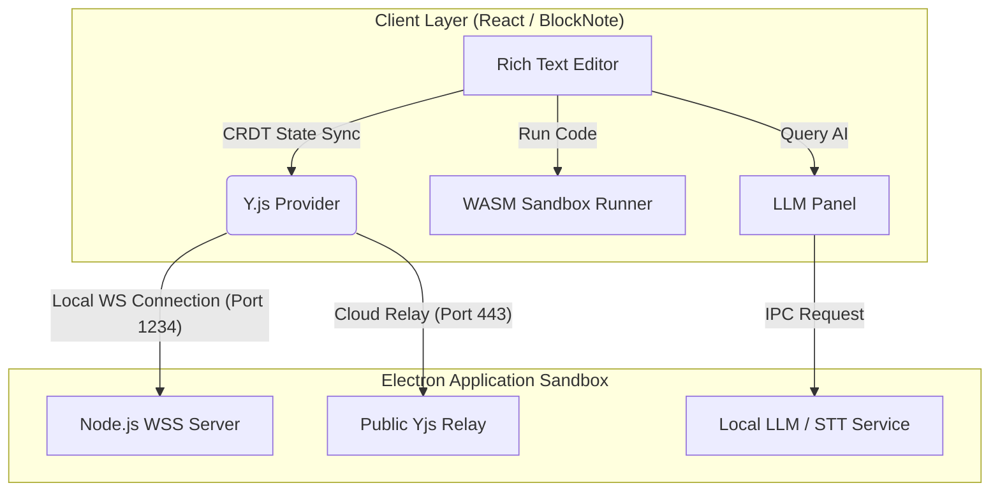

# AMEVA Workstation: AI-Powered Integrated Collaborative Media Workspace

> **[프로젝트 요약 (Resume Profile)]**
> 
> * **① 제목:** AI 기반 멀티미디어 통합 협업 워크스테이션 (AMEVA Workstation)
> * **② 주제:** 
>   * 마크다운 파서를 기반으로 로컬 LLM AI 추론 패널, 다국어 샌드박스 런타임, 리치 미디어(오디오/비디오/이미지) 저작 도구를 융합한 엔터프라이즈 데스크톱 에디터
>   * Y.js CRDT 기반의 듀얼 네트워크 모델(로컬 P2P 서버 및 공용 클라우드 릴레이)을 적용하여 동시 문서 공동 편집 및 인스턴트 채팅 채널 설계
>   * 격리된 iframe 환경을 활용하여 HTML/CSS 샌드박스 라이브 미리보기와 모달 뷰어를 통해 웹 컴포넌트 실시간 개발 및 렌더링 지원
> * **③ 내용요지:**
>   * **사용 기술:** Electron, React, BlockNote Editor, Y.js (CRDT), Node.js WebSocketServer, Vite, Vanilla CSS
>   * **주요 구성 요소:** AI Chat & Prompt Panel, Multi-Language Code Block Runner, Y.js Dual WebSocket Engine, Media Streaming Player
>   * **핵심 아키텍처:** Electron Main IPC -> Node WebSocket Server (Port 1234) -> React Client CRDT sync (Y.js WebSockets Provider) -> ProseMirror/BlockNote state merge
> * **④ 기여도:** 단독 개발 (100% - 아키텍처 설계 및 코어 기능 구현 전담)

---

## 1. 프로젝트 목적 및 필요성

본 프로젝트는 단순 텍스트 기록에 한정되어 있던 기존 마크다운 에디터의 한계를 극복하고, 멀티미디어 가공, 소스코드 셀 실행, AI 어시스턴스, 실시간 협업을 단일 데스크톱 애플리케이션으로 통합 제어하는 차세대 AI-Powered 워크스테이션 구축을 목적으로 합니다. 

로컬 격리 샌드박스를 채택하여 보안이 보장된 개인 연구 환경과 대화형 협업 세션을 유연하게 전환할 수 있는 통합 저작도구를 제공합니다.

---

## 2. 주요 기능 및 연구 목표

* **인터랙티브 샌드박스 런타임**: JS, Python, SQL, HTML 코드를 별도 외부 컴파일러 없이 문서 내부 셀에서 직접 실행하고 결과를 가시화합니다.
* **CRDT 기반의 협업 아키텍처**: P2P 로컬 소켓 모드와 공용 클라우드 중계 릴레이 모드를 제공하여, 어떠한 방화벽이나 외부망 차단 환경에서도 문서를 실시간으로 동기화합니다.
* **리치 멀티미디어 저작 허브**: 이미지 크기 동적 조절 및 오디오/비디오 파일의 원활한 탑재 및 스트리밍 플레이어를 제공합니다.
* **Mermaid 다이어그램 엔진**: 텍스트 정의 기반 다이어그램(Flow, Sequence, ERD)의 실시간 렌더링 동기화를 보장합니다.

---

## 3. 개요 (Abstract)

AMEVA Workstation은 대규모 로컬 지식 기반 관리와 미디어 편집을 필요로 하는 사용자를 위한 지능형 데스크톱 저작 플랫폼입니다. 일렉트론(Electron) 보안 샌드박스를 기반으로 리액트(React) 가상 DOM과 Y.js 공동 편집 코어를 견고하게 바인딩하여, 오프라인 독립 추론과 다자간 실시간 세션을 유연하게 관리합니다. 불필요한 고비용 아키텍처를 최소화하고 웹 표준 컴포넌트와 브라우저 샌드박스를 적절히 격리하여 보안성과 안정성을 높였습니다.

---

## 4. 시스템 아키텍처 설계 (Software Architecture Design)



---

## 5. 설치 및 구동 가이드

### 요구 사양
- Node.js v18.0.0 이상
- npm v9.0.0 이상

### 설치 및 로컬 서버 가동
```bash
git clone https://github.com/uno-km/AMEVA-Workstation.git
cd AMEVA-Workstation
npm install
npm run dev
```

---

## 6. 로드맵 및 다가올 기능 (Roadmap)
- [ ] LLM 채팅 기능 고도화: 대화 내용 스레드 관리 및 프롬프트 템플릿
- [ ] 멀티미디어 블록 강화: 이미지 크기 조절, 인라인 비디오/오디오 커스텀 플레이어 탑재
- [ ] Mermaid 렌더링 안정화: 복잡한 다이어그램의 실시간 편집 시 싱크 렉 박멸
