# AMEVA — AI-Powered Integrated Collaborative Workstation
## Enterprise Architecture & Technical Design Document
### Version 1.0 | 2026-07-02 | Confidential

---

> **분류**: 기술 설계서 (Technical Design Specification)  
> **대상 독자**: CTO, 수석 엔지니어, 투자자, 아키텍처 리뷰어  
> **목적**: 상용 서비스 수준의 차세대 AI 기반 통합 협업 워크스테이션 전체 설계

---

# 1. Executive Summary

AMEVA(Adaptive Multi-modal Enterprise Velocity Architecture)는 Notion, Google Docs, VS Code, Slack, Discord, Figma, Obsidian, Zoom, Git의 핵심 기능을 단일 플랫폼으로 통합한 **차세대 AI Native 협업 워크스테이션**이다.

기존 협업 도구들의 근본적 문제는 **컨텍스트 단절**이다. 문서는 Notion에, 코드는 VSCode에, 채팅은 Slack에, 회의는 Zoom에 분산되어 있어 생산성을 저해한다. AMEVA는 이 모든 워크플로우를 하나의 통합된 공간에서 처리한다.

**핵심 차별점:**
- **AI Native Architecture**: 단순 AI 플러그인이 아닌, 모든 블록·문서·워크스페이스 레벨에서 AI가 내재화
- **CRDT 기반 실시간 협업**: 오프라인 상태에서도 편집 가능, 온라인 복귀 시 자동 병합
- **Block-Everything Philosophy**: 문서, 채팅, 회의록, 코드 실행 결과까지 모든 것이 블록
- **Electron + PWA 동시 지원**: 데스크톱과 웹 모두 동일한 사용자 경험 제공
- **엔터프라이즈 보안**: E2E 암호화, RBAC, SSO, 감사 로그 완비

**목표 시장:**
- TAM: 전 세계 협업 소프트웨어 시장 (2026년 기준 약 $28B)
- SAM: AI Native 통합 워크스페이스 (약 $6.5B)
- SOM: 스타트업·기술 기업·엔터프라이즈 (초기 3년 $150M ARR 목표)

---

# 2. Vision

```
"모든 작업이 하나의 공간에서, AI와 함께, 팀 전체가 동시에."
```

## 2.1 제품 철학

| 원칙 | 설명 |
|------|------|
| **Single Source of Truth** | 모든 지식, 결정, 작업이 하나의 플랫폼에 |
| **AI as a Collaborator** | AI는 도구가 아닌 팀의 일원 |
| **Offline-First** | 네트워크 없이도 100% 동작 |
| **Privacy by Design** | 데이터 주권은 사용자에게 |
| **Block as DNA** | 모든 콘텐츠의 원자 단위는 블록 |

## 2.2 경쟁 포지셔닝

```
                    AI Native
                        ↑
              AMEVA ★  │
                        │
  Simple ←──────────────┼──────────────→ Complex
                        │
          Notion        │    VSCode
                        │
                        ↓
                  Traditional
```

## 2.3 사용자 페르소나

**Persona 1 — 스타트업 CTO (Alex)**
- 코드 리뷰, 기술 문서, 팀 협업을 하나에서
- AI 코드 생성 + 문서 자동화 요구

**Persona 2 — 기획자 (Mia)**
- PRD 작성, 회의록, 칸반 보드, 팀 공유
- AI 초안 생성 + 회의 자동 정리 요구

**Persona 3 — 연구자 (Jin)**
- 논문 분석, 노트 링크, Mermaid 다이어그램
- AI 요약 + 인용 관리 요구

**Persona 4 — 엔터프라이즈 팀장 (Park)**
- 100명+ 팀 관리, 권한 제어, 감사 로그
- 보안 + 컴플라이언스 요구

---

# 3. User Flow

## 3.1 핵심 사용자 플로우

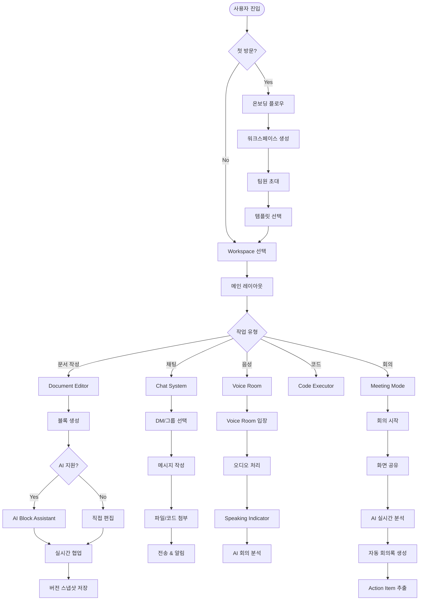

## 3.2 문서 편집 상세 플로우

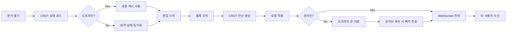

---

# 4. Information Architecture

## 4.1 계층 구조

```
AMEVA Platform
├── Organization (조직)
│   ├── 청구 정보
│   ├── SSO 설정
│   ├── 보안 정책
│   └── 멤버 관리
│
├── Workspace (워크스페이스)
│   ├── Settings
│   ├── Integrations
│   ├── Members & Roles
│   └── Projects
│       └── Project (프로젝트)
│           ├── Members
│           ├── Settings
│           └── Folders
│               └── Folder (폴더)
│                   └── Documents
│                       └── Document (문서)
│                           ├── Blocks
│                           │   ├── Text Block
│                           │   ├── Code Block
│                           │   ├── Table Block
│                           │   ├── Canvas Block
│                           │   ├── Database Block
│                           │   └── Embed Block
│                           ├── Version History
│                           ├── Comments
│                           └── AI Context
│
├── Communication
│   ├── Direct Messages
│   ├── Group Channels
│   ├── Voice Rooms
│   └── Threads
│
├── AI System
│   ├── Block AI
│   ├── Document AI
│   ├── Workspace AI
│   └── Meeting AI
│
└── System
    ├── Presence Engine
    ├── Notification Engine
    ├── Search Engine
    └── File System
```

## 4.2 내비게이션 구조

```
┌─────────────────────────────────────────────────────┐
│  SIDEBAR (240px)     │  MAIN CONTENT               │
│  ─────────────────   │  ─────────────────────────  │
│  [Logo] AMEVA       │  [Toolbar]                   │
│                     │  [Editor / Canvas / Chat]     │
│  ▼ Workspace        │                              │
│    ▼ Projects       │  [AI Panel - Collapsible]    │
│      ▼ Folders      │                              │
│        Documents    │                              │
│                     │                              │
│  ─────────────────  │                              │
│  CHAT               │                              │
│  ─────────────────  │                              │
│  VOICE              │                              │
│  ─────────────────  │                              │
│  [User Status]      │                              │
└─────────────────────────────────────────────────────┘
```

---

# 5. System Architecture

## 5.1 전체 아키텍처 다이어그램

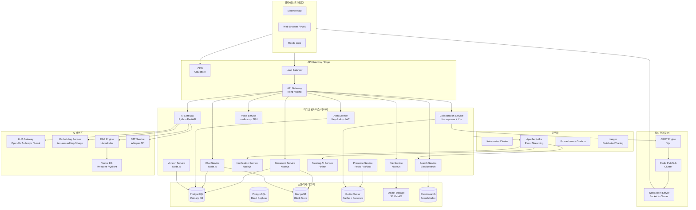

## 5.2 마이크로서비스 책임 분리

| 서비스 | 언어/런타임 | 책임 | 스케일 전략 |
|--------|------------|------|------------|
| Auth Service | Node.js + Keycloak | 인증/인가/SSO | Stateless HPA |
| Document Service | Node.js | 문서 CRUD, 블록 관리 | HPA |
| Collaboration Service | Node.js + Y.js | CRDT 동기화 | Sticky Session |
| Chat Service | Node.js | 메시지, 스레드 | HPA |
| Voice Service | Node.js + mediasoup | WebRTC SFU | GPU Node Pool |
| AI Gateway | Python FastAPI | LLM 라우팅, RAG | GPU HPA |
| File Service | Node.js | 업로드, 변환 | HPA + Job Queue |
| Notification Service | Node.js | 푸시, 이메일, 인앱 | HPA |
| Search Service | Node.js | 전문 검색 | Read Replica |
| Meeting AI | Python | 회의 분석, STT | GPU HPA |
| Version Service | Node.js | 스냅샷, diff | HPA |
| Presence Service | Node.js | 실시간 상태 | Redis Cluster |

---

# 6. Frontend Design

## 6.1 기술 스택 및 선정 이유

```
Frontend Stack:
├── Core Framework: React 19 (Concurrent Mode)
│   └── 이유: 서버 컴포넌트, Concurrent Features로 대규모 문서 렌더링 최적화
│
├── State Management
│   ├── Zustand (로컬 UI 상태)
│   │   └── 이유: 보일러플레이트 최소화, CRDT와의 자연스러운 통합
│   ├── TanStack Query (서버 상태)
│   │   └── 이유: 캐싱, 낙관적 업데이트, 백그라운드 리페치
│   └── Y.js (협업 상태)
│       └── 이유: CRDT 업계 표준, 오프라인 지원 완비
│
├── Editor Core: ProseMirror + TipTap
│   └── 이유: 가장 강력한 Block Editor 기반,
│            Notion/Linear/Loom 모두 사용
│            커스텀 노드 확장성 최고
│
├── UI Framework
│   ├── Vanilla CSS + CSS Variables (Design Tokens)
│   ├── CSS Modules (컴포넌트 스코핑)
│   └── Framer Motion (애니메이션)
│       └── 이유: 선언적 애니메이션, gesture 지원,
│                layout animation 자동화
│
├── Canvas: Konva.js / Excalidraw Core
│   └── 이유: Infinite Canvas 구현, Draw.io 수준 도형 지원
│
├── Code Execution
│   ├── Monaco Editor (코드 편집)
│   └── Pyodide + QuickJS (브라우저 내 실행)
│       └── 이유: 서버 없이 Python/JS 실행 가능 (보안 샌드박스)
│
├── Realtime: Y.js + Socket.io Client
│
├── Voice: mediasoup-client + WebRTC
│
├── Charts: D3.js + Observable Plot
│
├── Desktop: Electron 32
│   └── ipcMain/ipcRenderer 통신
│   └── Native 알림, 트레이, 자동 업데이트
│
└── Build: Vite 6 + TypeScript 5.5
    └── 이유: 빠른 HMR, 트리 셰이킹,
             Electron 및 브라우저 동시 타겟 지원
```

## 6.2 디자인 시스템

### 색상 팔레트 (Dark Mode 우선)

```css
:root {
  /* Brand Colors */
  --color-brand-50:  #f0f4ff;
  --color-brand-100: #dde8ff;
  --color-brand-200: #c0d4ff;
  --color-brand-300: #93b8ff;
  --color-brand-400: #5e93ff;
  --color-brand-500: #3b6ff5;  /* Primary */
  --color-brand-600: #2855e0;
  --color-brand-700: #1f42c7;
  --color-brand-800: #1e37a1;
  --color-brand-900: #1c3080;

  /* Neutral (Dark Mode) */
  --color-bg-primary:    #0d0f14;
  --color-bg-secondary:  #13161e;
  --color-bg-tertiary:   #1a1e2a;
  --color-bg-elevated:   #1f2436;
  --color-bg-glass:      rgba(255,255,255,0.04);
  
  /* Text */
  --color-text-primary:   #e8eaf2;
  --color-text-secondary: #9096b0;
  --color-text-muted:     #5a6080;
  
  /* Accent */
  --color-accent-green:   #00d4aa;
  --color-accent-purple:  #9d6fff;
  --color-accent-orange:  #ff8c42;
  --color-accent-red:     #ff4d6d;
  
  /* Glass Morphism */
  --glass-bg:      rgba(255,255,255,0.06);
  --glass-border:  rgba(255,255,255,0.10);
  --glass-shadow:  0 8px 32px rgba(0,0,0,0.4);
  --glass-blur:    blur(20px);
  
  /* Typography */
  --font-sans:  'Inter', -apple-system, sans-serif;
  --font-mono:  'JetBrains Mono', 'Fira Code', monospace;
  --font-prose: 'Lora', Georgia, serif;
  
  /* Spacing System (4px base) */
  --space-1:  4px;
  --space-2:  8px;
  --space-3:  12px;
  --space-4:  16px;
  --space-6:  24px;
  --space-8:  32px;
  --space-12: 48px;
  --space-16: 64px;
  
  /* Border Radius */
  --radius-sm:  6px;
  --radius-md:  10px;
  --radius-lg:  16px;
  --radius-xl:  24px;
  --radius-full: 9999px;
  
  /* Motion */
  --ease-spring:    cubic-bezier(0.34, 1.56, 0.64, 1);
  --ease-out:       cubic-bezier(0.0, 0.0, 0.2, 1);
  --duration-fast:  120ms;
  --duration-normal: 220ms;
  --duration-slow:  380ms;
}
```

### Glass Morphism 컴포넌트 패턴

```css
.glass-panel {
  background: var(--glass-bg);
  backdrop-filter: var(--glass-blur);
  -webkit-backdrop-filter: var(--glass-blur);
  border: 1px solid var(--glass-border);
  box-shadow: var(--glass-shadow);
  border-radius: var(--radius-lg);
  transition: 
    background var(--duration-normal) var(--ease-out),
    box-shadow var(--duration-normal) var(--ease-out);
}

.glass-panel:hover {
  background: rgba(255,255,255,0.09);
  box-shadow: 0 12px 48px rgba(0,0,0,0.5);
}
```

## 6.3 레이아웃 구조

```
┌──────────────────────────────────────────────────────────────────┐
│  [◉ AMEVA]  [WorkspaceSelect ▼]            [Search] [Notif] [Me] │  ← TopBar (48px)
├──────────────────────────────────────────────────────────────────┤
│           │                                         │            │
│  SIDEBAR  │           MAIN CONTENT                 │  AI PANEL  │
│  (240px)  │                                         │  (320px)   │
│           │  ┌──────────────────────────────────┐  │ (토글 가능)│
│  ▼ DOCS   │  │  Document Title                  │  │            │
│   ▸ Proj1 │  │  ──────────────────────────────  │  │  Context   │
│   ▸ Proj2 │  │  [Block 1: Text]                 │  │  Chat      │
│           │  │  [Block 2: Code]                 │  │            │
│  CHAT     │  │  [Block 3: Table]                │  │  Insights  │
│   # gen   │  │  [Block 4: AI Generated]         │  │            │
│   # eng   │  │  ⊕ Add Block                     │  │  Actions   │
│           │  └──────────────────────────────────┘  │            │
│  VOICE    │                                         │            │
│  [Room 1] │                                         │            │
│           │                                         │            │
├──────────────────────────────────────────────────────────────────┤
│  [●Online] [현재 문서: 3명 편집 중 🟢🔵🟡]  [Share] [History]  │  ← StatusBar
└──────────────────────────────────────────────────────────────────┘
```

---

# 7. Backend Design

## 7.1 백엔드 기술 스택

```
Backend Stack:
├── API Server: Node.js + Fastify
│   └── 이유: Express보다 2-3배 빠른 처리량,
│            스키마 기반 직렬화로 타입 안전성
│
├── AI Services: Python + FastAPI
│   └── 이유: ML 생태계 최적, async 지원,
│            Pydantic 데이터 검증
│
├── Realtime: Hocuspocus (Y.js Server)
│   └── 이유: TipTap 공식 서버, Y.js 네이티브,
│            Redis Pub/Sub 기반 수평 확장
│
├── Message Queue: Apache Kafka
│   └── 이유: 초당 수백만 이벤트 처리,
│            이벤트 소싱, 재처리 가능
│
├── Cache: Redis 7 Cluster
│   └── 이유: Pub/Sub, 세션, Presence, 
│            Sorted Set으로 랭킹/타임라인
│
├── Primary DB: PostgreSQL 16
│   └── 이유: JSONB로 동적 블록 메타데이터,
│            논리적 복제, PITR 백업
│
├── Document DB: MongoDB
│   └── 이유: 블록 콘텐츠의 유연한 스키마,
│            집계 파이프라인
│
├── Search: Elasticsearch 8
│   └── 이유: 전문 검색, 한국어 형태소 분석,
│            BM25 + 벡터 검색 하이브리드
│
├── Voice: mediasoup (SFU)
│   └── 이유: WebRTC SFU 중 최고 성능,
│            Node.js 네이티브, 선택적 포워딩
│
├── File Processing: Pandoc + LibreOffice
│   └── 이유: 가장 광범위한 포맷 변환 지원
│
└── Object Storage: AWS S3 / MinIO
    └── 이유: 무제한 파일 저장, CDN 연동
```

## 7.2 Document Service 상세 설계

```typescript
// document.service.ts

interface DocumentService {
  // 문서 CRUD
  createDocument(data: CreateDocumentDTO): Promise<Document>;
  getDocument(id: string, userId: string): Promise<DocumentWithBlocks>;
  updateDocument(id: string, data: UpdateDocumentDTO): Promise<Document>;
  deleteDocument(id: string): Promise<void>;
  
  // 블록 관리
  createBlock(docId: string, data: CreateBlockDTO): Promise<Block>;
  updateBlock(blockId: string, data: UpdateBlockDTO): Promise<Block>;
  deleteBlock(blockId: string): Promise<void>;
  reorderBlocks(docId: string, order: string[]): Promise<void>;
  
  // 접근 제어
  checkPermission(userId: string, docId: string, action: Permission): Promise<boolean>;
  shareDocument(docId: string, targets: ShareTarget[]): Promise<ShareResult>;
}

// Block 타입 시스템
type BlockType = 
  | 'paragraph'
  | 'heading' 
  | 'code'
  | 'table'
  | 'callout'
  | 'toggle'
  | 'math'
  | 'mermaid'
  | 'canvas'
  | 'database'
  | 'kanban'
  | 'timeline'
  | 'calendar'
  | 'image'
  | 'video'
  | 'embed'
  | 'columns'
  | 'divider'
  | 'ai_generated';

interface Block {
  id: string;
  documentId: string;
  type: BlockType;
  content: Record<string, unknown>;  // 타입별 동적 콘텐츠
  position: number;
  parentId: string | null;
  metadata: BlockMetadata;
  aiContext?: AIBlockContext;
  createdAt: Date;
  updatedAt: Date;
  createdBy: string;
}
```

## 7.3 API Gateway 설계

```yaml
# Kong Gateway 라우팅 설정

services:
  - name: document-service
    url: http://document-service:3001
    routes:
      - paths: ["/api/v1/documents"]
        methods: [GET, POST, PUT, DELETE]
    plugins:
      - name: jwt
      - name: rate-limiting
        config:
          minute: 300
          hour: 10000
      - name: request-size-limiting
        config:
          allowed_payload_size: 50  # MB

  - name: ai-service
    url: http://ai-service:8000
    routes:
      - paths: ["/api/v1/ai"]
    plugins:
      - name: jwt
      - name: rate-limiting
        config:
          minute: 60  # AI 호출 제한
      - name: request-transformer
        
  - name: voice-service
    url: http://voice-service:4000
    routes:
      - paths: ["/api/v1/voice"]
    plugins:
      - name: jwt
```

---

# 8. Realtime Collaboration Engine

## 8.1 CRDT 기반 협업 아키텍처

**선택 기술: Y.js**

Y.js를 선택한 이유:
1. **산업 표준**: Notion, Linear, Figma 벤치마크 대비 최고 성능
2. **오프라인 우선**: 로컬에서 편집 후 온라인 복귀 시 자동 병합
3. **서브타입 풍부**: YText, YArray, YMap으로 복잡한 블록 구조 표현
4. **작은 번들 크기**: ~29KB gzipped

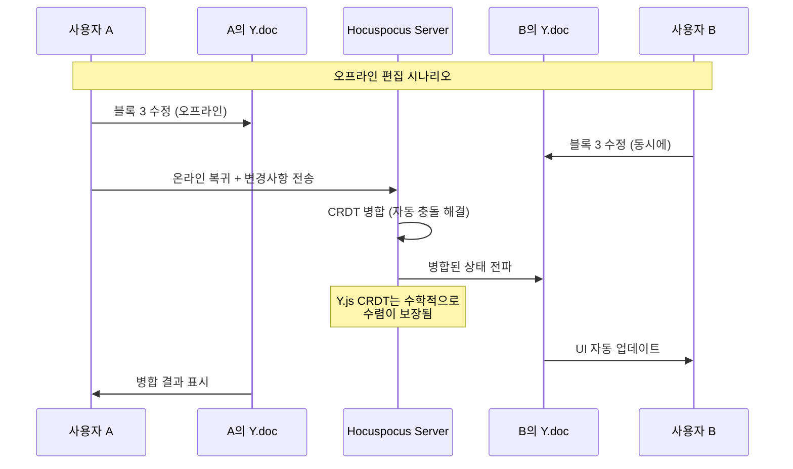

## 8.2 Hocuspocus 서버 구성

```typescript
// collaboration-server.ts
import { Server } from '@hocuspocus/server';
import { Redis } from '@hocuspocus/extension-redis';
import { Logger } from '@hocuspocus/extension-logger';
import { Database } from '@hocuspocus/extension-database';

const server = Server.configure({
  port: 1234,
  
  extensions: [
    // Redis Pub/Sub로 다중 서버 인스턴스 동기화
    new Redis({
      host: process.env.REDIS_HOST,
      port: 6379,
      options: {
        password: process.env.REDIS_PASSWORD,
        tls: process.env.NODE_ENV === 'production',
      },
    }),
    
    // MongoDB에 Y.js 문서 영속화
    new Database({
      fetch: async ({ documentName }) => {
        const doc = await DocumentModel.findOne({ 
          ydocId: documentName 
        });
        return doc?.ydocState ? Buffer.from(doc.ydocState) : null;
      },
      store: async ({ documentName, state }) => {
        await DocumentModel.updateOne(
          { ydocId: documentName },
          { 
            ydocState: state,
            lastSyncedAt: new Date()
          },
          { upsert: true }
        );
        
        // 버전 스냅샷 트리거 (Kafka 이벤트)
        await kafkaProducer.send({
          topic: 'document.snapshot',
          messages: [{
            key: documentName,
            value: JSON.stringify({
              documentId: documentName,
              state: Array.from(state),
              timestamp: Date.now()
            })
          }]
        });
      },
    }),
    
    new Logger(),
  ],
  
  // 연결 인증
  async onAuthenticate(data) {
    const { token, documentName } = data;
    
    const user = await verifyJWT(token);
    if (!user) throw new Error('Unauthorized');
    
    const hasAccess = await checkDocumentPermission(
      user.id, 
      documentName, 
      'read'
    );
    if (!hasAccess) throw new Error('Forbidden');
    
    return { user };
  },
  
  // 실시간 Awareness (커서, 선택, 사용자 정보)
  async onAwarenessUpdate({ documentName, awareness, context }) {
    // Presence Service로 상태 브로드캐스트
    await presenceService.update(documentName, awareness);
  },
  
  // 저장 최적화: 100ms 디바운싱
  debounce: 100,
  maxDebounce: 5000,
});

server.listen();
```

## 8.3 Y.js 블록 데이터 구조

```typescript
// editor-store.ts - Y.js 기반 문서 상태 관리

import * as Y from 'yjs';
import { WebsocketProvider } from 'y-websocket';

interface YBlock {
  id: string;
  type: string;
  content: Y.Map<unknown>;
  children: Y.Array<string>;  // 자식 블록 ID 목록
  metadata: Y.Map<unknown>;
}

class DocumentYStore {
  ydoc: Y.Doc;
  provider: WebsocketProvider;
  
  // 최상위 데이터 구조
  blocks: Y.Map<YBlock>;      // blockId -> block data
  blockOrder: Y.Array<string>; // 루트 레벨 순서
  meta: Y.Map<unknown>;        // 문서 메타데이터
  
  constructor(documentId: string, token: string) {
    this.ydoc = new Y.Doc();
    this.blocks = this.ydoc.getMap('blocks');
    this.blockOrder = this.ydoc.getArray('blockOrder');
    this.meta = this.ydoc.getMap('meta');
    
    // WebSocket 연결
    this.provider = new WebsocketProvider(
      `wss://${process.env.COLLAB_SERVER}/collab`,
      documentId,
      this.ydoc,
      {
        params: { token },
        connect: true,
        resyncInterval: 3000,
      }
    );
    
    // 오프라인 지원: IndexedDB 영속화
    const { IndexeddbPersistence } = await import('y-indexeddb');
    new IndexeddbPersistence(`ameva-doc-${documentId}`, this.ydoc);
  }
  
  // 블록 생성 (트랜잭션으로 원자성 보장)
  createBlock(type: string, position: number, parentId?: string): string {
    const blockId = generateNanoId();
    
    this.ydoc.transact(() => {
      const blockMap = new Y.Map<unknown>();
      blockMap.set('id', blockId);
      blockMap.set('type', type);
      blockMap.set('content', new Y.Map());
      blockMap.set('children', new Y.Array());
      
      this.blocks.set(blockId, blockMap as unknown as YBlock);
      
      if (parentId) {
        const parent = this.blocks.get(parentId);
        (parent?.children as Y.Array<string>).insert(position, [blockId]);
      } else {
        this.blockOrder.insert(position, [blockId]);
      }
    });
    
    return blockId;
  }
  
  // Awareness (Live Cursor + Presence)
  updateUserAwareness(data: UserAwareness) {
    this.provider.awareness.setLocalState({
      user: data.user,
      cursor: data.cursor,
      selection: data.selection,
      scrollPosition: data.scrollPosition,
      status: data.status,
    });
  }
}
```

## 8.4 충돌 해결 전략

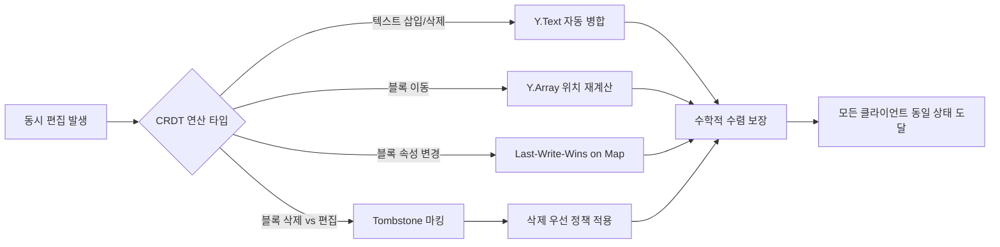

**충돌 케이스별 전략:**

| 케이스 | CRDT 처리 | 사용자 경험 |
|--------|-----------|------------|
| 동시 텍스트 삽입 | 위치 기반 인터리빙 | 자연스럽게 합쳐짐 |
| 동시 블록 삭제+편집 | 삭제 우선, Tombstone | "삭제된 블록" 알림 |
| 동시 블록 이동 | 서버 수신 순서 기반 | 최종 위치로 수렴 |
| 네트워크 분리 후 복귀 | 오프라인 ops 일괄 전송 | 자동 병합, 변경 표시 |

---

# 9. Presence Engine

## 9.1 아키텍처

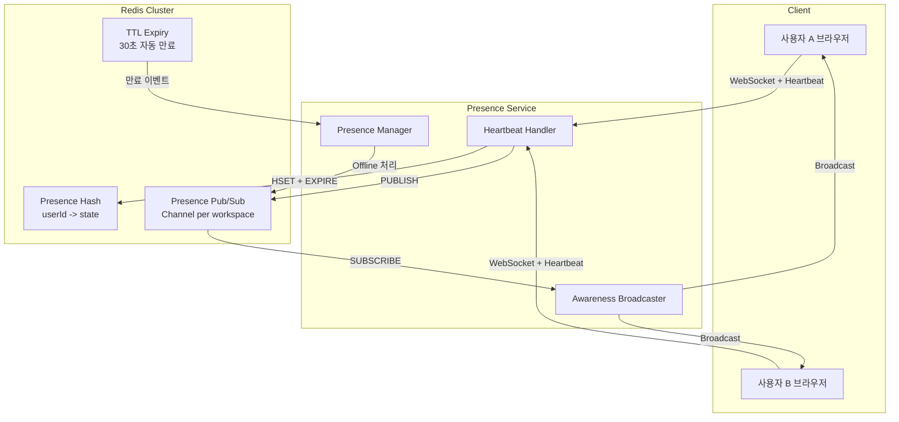

## 9.2 Presence 상태 모델

```typescript
interface UserPresence {
  userId: string;
  workspaceId: string;
  
  // 상태 계층
  connectionStatus: 'online' | 'offline' | 'idle';
  activityStatus: 'editing' | 'typing' | 'viewing' | 'talking' | 'idle';
  
  // 현재 위치
  currentDocument?: string;
  currentBlock?: string;
  
  // 커서 정보 (문서 내)
  cursor?: {
    blockId: string;
    offset: number;
    anchor?: number;
    head?: number;
  };
  
  // 뷰포트 (시선 공유)
  viewport?: {
    scrollTop: number;
    scrollLeft: number;
    zoom: number;
    enabled: boolean;  // 사용자 동의 여부
  };
  
  // 음성
  voice?: {
    roomId: string;
    isSpeaking: boolean;
    isMuted: boolean;
    audioLevel: number;  // 0-100
  };
  
  // 메타
  userInfo: {
    name: string;
    avatar: string;
    color: string;  // 사용자별 고유 색상
  };
  
  lastSeenAt: number;  // Unix timestamp
  ttl: number;         // 30초
}
```

## 9.3 시선 공유 (Viewport Sharing) 설계

개인정보 보호 설계:

```typescript
class ViewportSharingManager {
  private userConsent: Map<string, boolean> = new Map();
  
  // 동의 관리
  async requestConsent(userId: string): Promise<boolean> {
    const result = await showConsentModal({
      title: "시선 공유 동의",
      description: "팀원들이 당신이 보고 있는 문서 위치를 확인할 수 있습니다.",
      granularity: ['현재 문서', '스크롤 위치', '커서 위치'],
      revokeAnytime: true,
    });
    
    this.userConsent.set(userId, result.granted);
    await this.persistConsent(userId, result);
    return result.granted;
  }
  
  // 뷰포트 브로드캐스트 (동의한 경우만)
  broadcastViewport(data: ViewportData) {
    if (!this.userConsent.get(data.userId)) return;
    
    this.presenceChannel.publish({
      type: 'VIEWPORT_UPDATE',
      userId: data.userId,
      data: {
        documentId: data.documentId,
        scrollTop: Math.round(data.scrollTop / 100) * 100,  // 프라이버시: 100px 단위로 반올림
        zoom: data.zoom,
      }
    });
  }
  
  // 상시 취소 가능
  async revokeConsent(userId: string) {
    this.userConsent.set(userId, false);
    await this.presenceChannel.publish({
      type: 'VIEWPORT_REVOKED',
      userId: data.userId,
    });
  }
}
```

---

# 10. Voice Engine

## 10.1 WebRTC SFU 아키텍처

**선택 기술: mediasoup**

```
왜 SFU (Selective Forwarding Unit)?
- MCU: 서버가 모든 스트림 믹싱 → 고CPU, 음질 저하
- P2P: N*(N-1)/2 연결 → N>4명에서 클라이언트 과부하
- SFU: 서버가 스트림 라우팅만 → 저지연, 저CPU, 확장성 우수
```

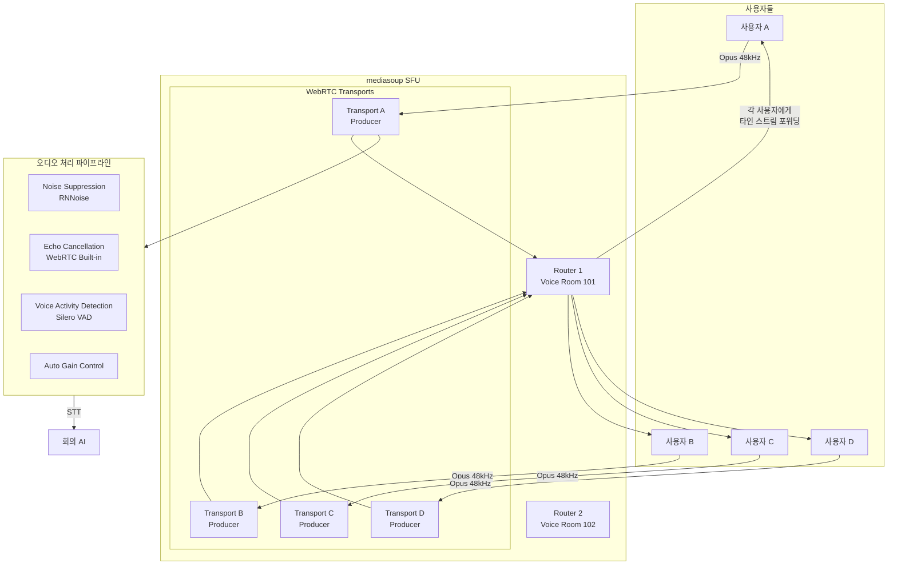

## 10.2 오디오 처리 파이프라인

```typescript
// voice-processor.ts

class AudioProcessingPipeline {
  private rnnoise: RNNoise;
  private sileroVAD: SileroVAD;
  
  async initialize() {
    // RNNoise: 머신러닝 기반 노이즈 억제
    this.rnnoise = await RNNoise.create();
    
    // Silero VAD: 발화 감지
    this.sileroVAD = await SileroVAD.create({
      positiveSpeechThreshold: 0.5,
      negativeSpeechThreshold: 0.35,
      preSpeechPadFrames: 1,
      redemptionFrames: 8,
    });
  }
  
  async processAudioFrame(frame: AudioFrame): Promise<ProcessedFrame> {
    // 1. Echo Cancellation (WebRTC 네이티브)
    const echoCancelled = await this.acousticEchoCanceler.process(frame);
    
    // 2. Noise Suppression (RNNoise)
    const denoised = this.rnnoise.processFrame(echoCancelled);
    
    // 3. VAD (Speaking Indicator)
    const vadResult = await this.sileroVAD.process(denoised);
    
    // 4. AGC (볼륨 정규화)
    const normalized = this.autoGainControl.process(denoised);
    
    return {
      audio: normalized,
      isSpeaking: vadResult.isSpeaking,
      speakingProbability: vadResult.probability,
      audioLevel: this.calculateRMS(normalized),
    };
  }
  
  // Push-to-Talk 모드
  enablePushToTalk(hotkey: string) {
    this.hotkey = hotkey;
    this.isPushToTalk = true;
    
    // Electron: globalShortcut 등록
    // Web: KeyboardEvent 리스너
    document.addEventListener('keydown', (e) => {
      if (e.code === hotkey && !this.isTransmitting) {
        this.startTransmitting();
      }
    });
    
    document.addEventListener('keyup', (e) => {
      if (e.code === hotkey) {
        this.stopTransmitting();
      }
    });
  }
}
```

## 10.3 Speaking Indicator UI

```typescript
// SpeakingIndicator.tsx

interface SpeakingIndicatorProps {
  users: UserPresence[];
  localUser: UserPresence;
}

const SpeakingIndicator: React.FC<SpeakingIndicatorProps> = ({ users }) => {
  return (
    <div className="voice-participants">
      {users.map(user => (
        <div 
          key={user.userId}
          className={`participant ${user.voice?.isSpeaking ? 'speaking' : ''}`}
          style={{ '--user-color': user.userInfo.color } as CSSProperties}
        >
          <div className="avatar-wrapper">
            
            
            {/* Speaking Animation: 음성 레벨에 따른 파동 효과 */}
            {user.voice?.isSpeaking && (
              <div 
                className="speaking-ring"
                style={{
                  '--audio-level': `${user.voice.audioLevel}%`,
                  animation: 'speaking-pulse 0.3s ease-in-out infinite'
                }}
              />
            )}
            
            {/* 음소거 표시 */}
            {user.voice?.isMuted && (
              <div className="muted-badge">🔇</div>
            )}
          </div>
          
          {/* 실시간 오디오 레벨 바 */}
          <div className="audio-level-bar">
            <div 
              className="audio-level-fill"
              style={{ width: `${user.voice?.audioLevel ?? 0}%` }}
            />
          </div>
          
          <span className="user-name">{user.userInfo.name}</span>
        </div>
      ))}
    </div>
  );
};
```

---

# 11. AI Engine

## 11.1 AI 아키텍처 전체 구조

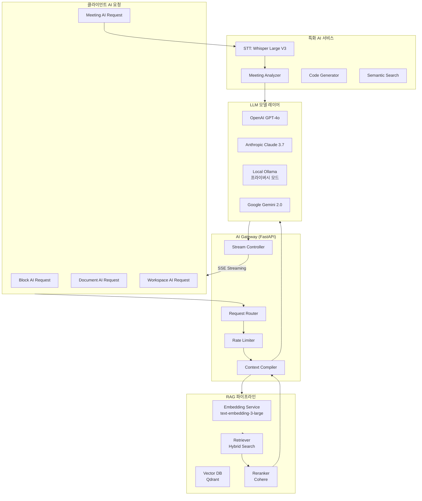

## 11.2 Block AI Assistant 구현

```typescript
// ai-block-assistant.ts

interface AIBlockRequest {
  action: AIAction;
  block: Block;
  documentContext: DocumentContext;
  workspaceContext?: WorkspaceContext;
  userInstruction?: string;
}

type AIAction = 
  | 'generate'
  | 'rewrite'
  | 'summarize'
  | 'translate'
  | 'expand'
  | 'shorten'
  | 'critique'
  | 'factcheck'
  | 'codegen'
  | 'improve'
  | 'meetingNotes'
  | 'chat';

class AIBlockAssistant {
  async processRequest(
    request: AIBlockRequest,
    onChunk: (chunk: string) => void
  ): Promise<AIResult> {
    
    // 1. 컨텍스트 수집
    const context = await this.compileContext(request);
    
    // 2. RAG 검색 (워크스페이스 지식 검색)
    const relevantDocs = await this.ragRetriever.search(
      request.userInstruction ?? request.block.content.toString(),
      request.workspaceContext?.workspaceId,
      { topK: 5 }
    );
    
    // 3. 프롬프트 구성
    const prompt = this.buildPrompt(request.action, {
      currentBlock: context.blockContent,
      surrounding: context.surroundingBlocks,
      document: context.documentOutline,
      retrieved: relevantDocs,
      instruction: request.userInstruction,
    });
    
    // 4. LLM 스트리밍 호출
    const stream = await this.llmGateway.streamChat({
      model: this.selectModel(request.action),
      messages: prompt,
      temperature: this.getTemperature(request.action),
      maxTokens: 4096,
    });
    
    let fullResponse = '';
    for await (const chunk of stream) {
      fullResponse += chunk;
      onChunk(chunk);  // SSE로 클라이언트에 실시간 스트리밍
    }
    
    // 5. 결과 후처리
    return {
      content: fullResponse,
      action: request.action,
      tokenUsed: stream.usage,
      model: stream.model,
    };
  }
  
  private selectModel(action: AIAction): LLMModel {
    switch (action) {
      case 'codegen':
        return 'gpt-4o';  // 코드 생성: GPT-4o 우선
      case 'factcheck':
        return 'claude-3-7-sonnet';  // 사실 검증: Claude 롱컨텍스트
      case 'translate':
        return 'gemini-2.0-flash';  // 번역: Gemini 다국어 강점
      default:
        return 'gpt-4o-mini';  // 일반: 비용 효율
    }
  }
  
  // 프롬프트 예시
  private buildPrompt(action: AIAction, ctx: PromptContext): Message[] {
    const systemPrompt = `당신은 AMEVA 문서 편집기의 AI 어시스턴트입니다.
현재 문서: "${ctx.document.title}"
섹션: "${ctx.currentBlock.sectionHeading}"

주변 컨텍스트:
${ctx.surrounding.map(b => b.text).join('\n')}

워크스페이스 관련 문서:
${ctx.retrieved.map(d => `[${d.title}]: ${d.excerpt}`).join('\n')}`;

    return [
      { role: 'system', content: systemPrompt },
      { role: 'user', content: this.getActionPrompt(action, ctx) }
    ];
  }
}
```

## 11.3 RAG 파이프라인 설계

```python
# rag_pipeline.py

from llama_index.core import VectorStoreIndex, SimpleDirectoryReader
from llama_index.vector_stores.qdrant import QdrantVectorStore
from llama_index.embeddings.openai import OpenAIEmbedding
from llama_index.core.retrievers import VectorIndexRetriever
from llama_index.core.postprocessor import CohereRerank

class WorkspaceRAGPipeline:
    def __init__(self, workspace_id: str):
        self.workspace_id = workspace_id
        self.embed_model = OpenAIEmbedding(
            model="text-embedding-3-large",
            dimensions=3072
        )
        
        # Qdrant: 워크스페이스별 컬렉션
        self.qdrant_client = QdrantClient(url=QDRANT_URL)
        self.collection_name = f"workspace_{workspace_id}"
        
    async def index_document(self, document: Document):
        """문서를 청크 분할 후 벡터 임베딩"""
        
        # 블록 단위 청킹 (의미 단위 보존)
        chunks = self.split_by_blocks(document.blocks)
        
        # 임베딩 배치 처리
        embeddings = await self.embed_model.aget_text_embedding_batch(
            [c.text for c in chunks],
            show_progress=True
        )
        
        # Qdrant 업서트
        points = [
            PointStruct(
                id=chunk.id,
                vector=embedding,
                payload={
                    'documentId': document.id,
                    'blockId': chunk.blockId,
                    'text': chunk.text,
                    'title': document.title,
                    'workspaceId': self.workspace_id,
                    'createdAt': document.createdAt.isoformat(),
                }
            )
            for chunk, embedding in zip(chunks, embeddings)
        ]
        
        self.qdrant_client.upsert(
            collection_name=self.collection_name,
            points=points
        )
    
    async def hybrid_search(
        self, 
        query: str, 
        top_k: int = 10
    ) -> list[SearchResult]:
        """BM25 + 벡터 하이브리드 검색"""
        
        query_embedding = await self.embed_model.aget_text_embedding(query)
        
        # 벡터 검색
        vector_results = self.qdrant_client.search(
            collection_name=self.collection_name,
            query_vector=query_embedding,
            limit=top_k * 2,
        )
        
        # BM25 키워드 검색 (Elasticsearch)
        keyword_results = await self.es_client.search(
            index=f"workspace_{self.workspace_id}",
            query={"match": {"text": query}},
            size=top_k * 2,
        )
        
        # RRF (Reciprocal Rank Fusion) 결합
        fused = self.rrf_merge(vector_results, keyword_results)
        
        # Cohere Reranker로 최종 재순위
        reranked = await self.reranker.arerank(
            query=query,
            documents=[r.text for r in fused],
            top_n=top_k
        )
        
        return reranked
```

## 11.4 Meeting AI 시스템

```python
# meeting_ai.py

class MeetingAIAnalyzer:
    def __init__(self):
        self.whisper = WhisperLargeV3()
        self.diarizer = PyAnnoteDiarizer()  # 화자 분리
        self.llm = AsyncOpenAI()
        
    async def analyze_meeting(
        self, 
        audio_stream: AsyncGenerator[bytes, None],
        participants: list[Participant],
        context: MeetingContext
    ) -> AsyncGenerator[MeetingInsight, None]:
        
        # 1. 실시간 STT (Whisper)
        async for audio_chunk in audio_stream:
            transcript = await self.whisper.transcribe_chunk(audio_chunk)
            
            # 화자 분리
            speaker = await self.diarizer.identify_speaker(
                audio_chunk, 
                participants
            )
            
            yield MeetingInsight(
                type='transcript',
                speaker=speaker,
                text=transcript.text,
                timestamp=transcript.timestamp
            )
        
        # 2. 전체 분석 (회의 종료 후)
        full_transcript = await self.get_full_transcript()
        
        analysis = await self.llm.chat.completions.create(
            model="gpt-4o",
            messages=[{
                "role": "system",
                "content": MEETING_ANALYSIS_SYSTEM_PROMPT
            }, {
                "role": "user", 
                "content": f"""
회의 정보:
- 제목: {context.title}
- 참가자: {', '.join(p.name for p in participants)}
- 시간: {context.duration}분

회의록:
{full_transcript}

다음을 JSON 형식으로 추출하라:
1. 전체 요약 (3-5문장)
2. 핵심 결정 사항 (목록)
3. Action Items (담당자, 기한 포함)
4. 논의 사항 (토픽별)
5. 참가자별 역할 및 발언 요약
6. 다음 회의 안건 제안
"""
            }],
            response_format={"type": "json_object"}
        )
        
        result = json.loads(analysis.choices[0].message.content)
        
        yield MeetingInsight(
            type='full_analysis',
            data=result,
            documentId=await self.create_meeting_doc(result, context)
        )
```

---

# 12. File Conversion Engine

## 12.1 변환 파이프라인

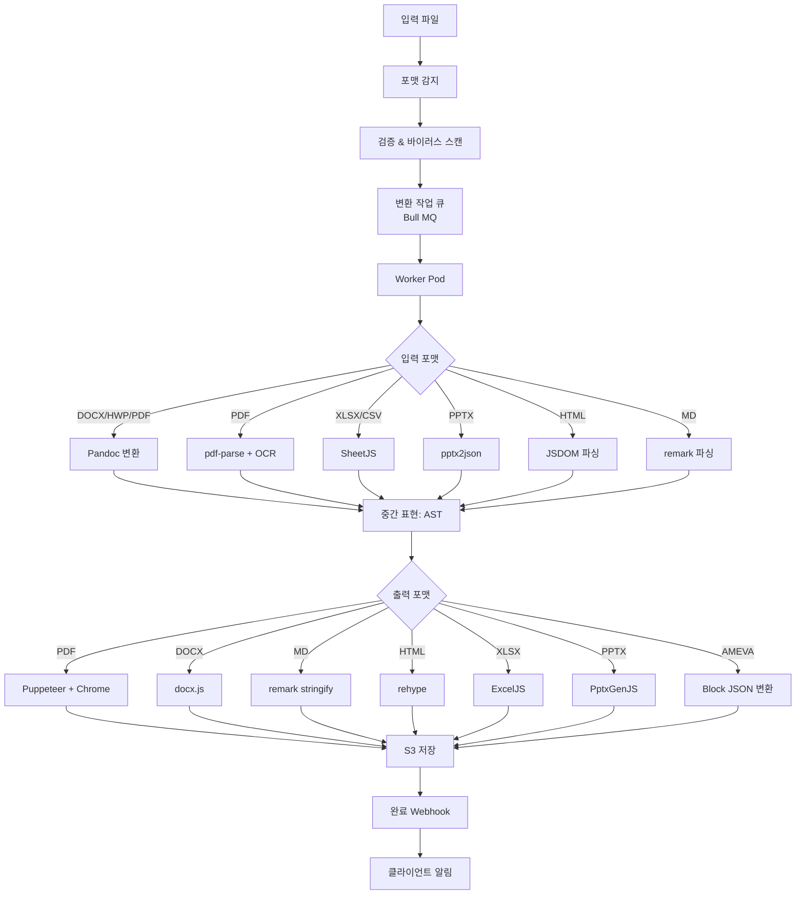

## 12.2 HWP 지원 전략

```
HWP (한글 파일) 지원은 기술적으로 어려운 과제:
- LibreOffice 7.x: HWP 읽기/쓰기 지원 (제한적)
- hwp.js: 브라우저 HWP 렌더링 (오픈소스)
- 전략: LibreOffice headless → DOCX → Pandoc → 내부 포맷
```

```bash
# HWP 변환 스크립트
libreoffice --headless \
  --convert-to docx \
  --outdir /tmp/converted \
  input.hwp

pandoc \
  /tmp/converted/input.docx \
  -f docx \
  -t json \
  --extract-media=/tmp/media \
  -o output.json
```

---

# 13. Version Control Engine

## 13.1 Git-Like 버전 관리

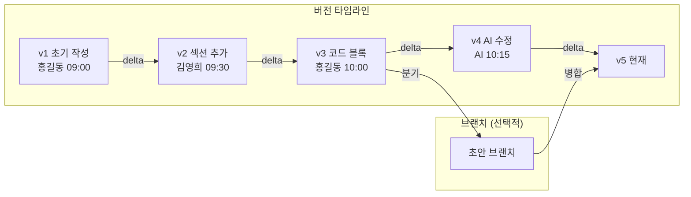

## 13.2 스냅샷 시스템 구현

```typescript
// version-control.service.ts

interface DocumentSnapshot {
  id: string;
  documentId: string;
  version: number;
  
  // 전체 Y.js 상태 (binary)
  ydocState: Buffer;
  
  // 가독성을 위한 텍스트 덤프
  textContent: string;
  
  // 변경 메타데이터
  changes: BlockChange[];
  
  // 커밋 정보
  author: User;
  message?: string;  // 선택적 커밋 메시지
  timestamp: Date;
  
  // diff 저장 (공간 최적화)
  isDelta: boolean;
  deltaFrom?: string;  // 기준 버전 ID
  deltaData?: Buffer;  // 이진 diff
}

interface BlockChange {
  blockId: string;
  action: 'added' | 'modified' | 'deleted' | 'moved';
  blockType: string;
  oldContent?: string;
  newContent?: string;
  position?: { from: number; to: number };
}

class VersionControlService {
  // 자동 스냅샷 (저장 시 트리거)
  async createSnapshot(
    documentId: string,
    userId: string,
    options: SnapshotOptions = {}
  ): Promise<DocumentSnapshot> {
    
    const currentState = await this.getYDocState(documentId);
    const prevSnapshot = await this.getLatestSnapshot(documentId);
    
    // Delta 압축 (이진 diff로 공간 절약)
    let snapshotData: Buffer;
    let isDelta = false;
    
    if (prevSnapshot && !options.fullSnapshot) {
      const delta = Y.encodeStateAsUpdateV2(
        Y.createDocFromState(currentState),
        prevSnapshot.ydocState
      );
      
      // delta가 전체보다 작을 때만 delta 사용
      if (delta.byteLength < currentState.byteLength * 0.7) {
        snapshotData = Buffer.from(delta);
        isDelta = true;
      } else {
        snapshotData = currentState;
      }
    } else {
      snapshotData = currentState;
    }
    
    // 블록별 변경사항 추출
    const changes = await this.computeBlockChanges(
      prevSnapshot?.textContent,
      await this.extractText(currentState)
    );
    
    const snapshot = await this.snapshotRepo.create({
      documentId,
      version: (prevSnapshot?.version ?? 0) + 1,
      ydocState: isDelta ? null : snapshotData,
      deltaFrom: isDelta ? prevSnapshot?.id : null,
      deltaData: isDelta ? snapshotData : null,
      textContent: await this.extractText(currentState),
      changes,
      author: userId,
      timestamp: new Date(),
      isDelta,
    });
    
    // Elasticsearch 인덱싱 (버전 검색)
    await this.indexSnapshot(snapshot);
    
    return snapshot;
  }
  
  // Time Travel: 특정 버전으로 복원
  async restoreVersion(
    documentId: string,
    snapshotId: string,
    restoredBy: string
  ): Promise<void> {
    const snapshot = await this.getSnapshotChain(snapshotId);
    const targetState = this.reconstructState(snapshot);
    
    // 현재 상태를 백업으로 저장
    await this.createSnapshot(documentId, restoredBy, {
      message: `복원 전 자동 백업 (→ v${snapshot.version})`,
      fullSnapshot: true,
    });
    
    // Y.js 상태 업데이트
    await this.applyYDocState(documentId, targetState);
    
    // 감사 로그
    await this.auditLog.record({
      action: 'DOCUMENT_RESTORED',
      documentId,
      userId: restoredBy,
      targetVersion: snapshot.version,
    });
  }
  
  // Git-Like Diff 생성
  async getDiff(
    snapshotIdA: string,
    snapshotIdB: string
  ): Promise<DiffResult> {
    const [stateA, stateB] = await Promise.all([
      this.reconstructState(await this.getSnapshotChain(snapshotIdA)),
      this.reconstructState(await this.getSnapshotChain(snapshotIdB)),
    ]);
    
    return this.diffEngine.compare(stateA, stateB, {
      granularity: 'block',  // 블록 단위 diff
      format: 'unified',
    });
  }
}
```

---

# 14. Database Schema

## 14.1 PostgreSQL 스키마

```sql
-- ============================================================
-- Organizations & Workspaces
-- ============================================================

CREATE TABLE organizations (
  id            UUID PRIMARY KEY DEFAULT gen_random_uuid(),
  name          VARCHAR(255) NOT NULL,
  slug          VARCHAR(100) UNIQUE NOT NULL,
  plan          VARCHAR(50) NOT NULL DEFAULT 'free',
  settings      JSONB DEFAULT '{}',
  sso_config    JSONB,
  billing_email VARCHAR(255),
  created_at    TIMESTAMPTZ DEFAULT NOW(),
  updated_at    TIMESTAMPTZ DEFAULT NOW()
);

CREATE TABLE workspaces (
  id              UUID PRIMARY KEY DEFAULT gen_random_uuid(),
  organization_id UUID REFERENCES organizations(id) ON DELETE CASCADE,
  name            VARCHAR(255) NOT NULL,
  slug            VARCHAR(100) NOT NULL,
  icon            VARCHAR(500),
  settings        JSONB DEFAULT '{}',
  is_public       BOOLEAN DEFAULT FALSE,
  created_by      UUID REFERENCES users(id),
  created_at      TIMESTAMPTZ DEFAULT NOW(),
  updated_at      TIMESTAMPTZ DEFAULT NOW(),
  
  UNIQUE(organization_id, slug)
);

-- ============================================================
-- Users & Authentication
-- ============================================================

CREATE TABLE users (
  id              UUID PRIMARY KEY DEFAULT gen_random_uuid(),
  email           VARCHAR(255) UNIQUE NOT NULL,
  name            VARCHAR(255) NOT NULL,
  avatar_url      VARCHAR(500),
  hashed_password VARCHAR(255),  -- null if SSO
  sso_provider    VARCHAR(50),
  sso_subject     VARCHAR(255),
  timezone        VARCHAR(100) DEFAULT 'UTC',
  locale          VARCHAR(20) DEFAULT 'ko-KR',
  preferences     JSONB DEFAULT '{}',
  
  -- AI 설정
  ai_settings     JSONB DEFAULT '{
    "defaultModel": "gpt-4o-mini",
    "privacyMode": false,
    "shareHistory": true
  }',
  
  -- 개인정보
  viewport_sharing_consent  BOOLEAN DEFAULT FALSE,
  last_active_at            TIMESTAMPTZ,
  created_at                TIMESTAMPTZ DEFAULT NOW(),
  updated_at                TIMESTAMPTZ DEFAULT NOW()
);

CREATE TABLE workspace_members (
  workspace_id  UUID REFERENCES workspaces(id) ON DELETE CASCADE,
  user_id       UUID REFERENCES users(id) ON DELETE CASCADE,
  role          VARCHAR(50) NOT NULL DEFAULT 'member',
  -- 'owner' | 'admin' | 'member' | 'viewer' | 'guest'
  permissions   JSONB DEFAULT '{}',
  joined_at     TIMESTAMPTZ DEFAULT NOW(),
  
  PRIMARY KEY (workspace_id, user_id)
);

-- ============================================================
-- Projects & Folders
-- ============================================================

CREATE TABLE projects (
  id            UUID PRIMARY KEY DEFAULT gen_random_uuid(),
  workspace_id  UUID REFERENCES workspaces(id) ON DELETE CASCADE,
  name          VARCHAR(255) NOT NULL,
  description   TEXT,
  icon          VARCHAR(500),
  color         VARCHAR(50),
  settings      JSONB DEFAULT '{}',
  created_by    UUID REFERENCES users(id),
  created_at    TIMESTAMPTZ DEFAULT NOW(),
  updated_at    TIMESTAMPTZ DEFAULT NOW()
);

CREATE TABLE folders (
  id          UUID PRIMARY KEY DEFAULT gen_random_uuid(),
  project_id  UUID REFERENCES projects(id) ON DELETE CASCADE,
  parent_id   UUID REFERENCES folders(id),
  name        VARCHAR(255) NOT NULL,
  icon        VARCHAR(500),
  position    INTEGER DEFAULT 0,
  created_by  UUID REFERENCES users(id),
  created_at  TIMESTAMPTZ DEFAULT NOW()
);

-- ============================================================
-- Documents
-- ============================================================

CREATE TABLE documents (
  id            UUID PRIMARY KEY DEFAULT gen_random_uuid(),
  folder_id     UUID REFERENCES folders(id),
  workspace_id  UUID REFERENCES workspaces(id),
  
  title         VARCHAR(1000) NOT NULL DEFAULT 'Untitled',
  icon          VARCHAR(500),
  cover_image   VARCHAR(500),
  
  -- Y.js 협업
  ydoc_id       VARCHAR(255) UNIQUE NOT NULL,  -- Hocuspocus 문서 ID
  
  -- 상태
  status        VARCHAR(50) DEFAULT 'draft',
  -- 'draft' | 'published' | 'archived' | 'template'
  
  -- 접근 제어
  visibility    VARCHAR(50) DEFAULT 'workspace',
  -- 'private' | 'workspace' | 'org' | 'public'
  
  -- 메타데이터
  word_count    INTEGER DEFAULT 0,
  block_count   INTEGER DEFAULT 0,
  view_count    BIGINT DEFAULT 0,
  
  -- 버전
  current_version  INTEGER DEFAULT 1,
  
  -- AI 컨텍스트
  ai_summary    TEXT,
  ai_tags       TEXT[],
  embedding_updated_at  TIMESTAMPTZ,
  
  -- 감사
  created_by    UUID REFERENCES users(id),
  last_edited_by UUID REFERENCES users(id),
  created_at    TIMESTAMPTZ DEFAULT NOW(),
  updated_at    TIMESTAMPTZ DEFAULT NOW(),
  published_at  TIMESTAMPTZ,
  archived_at   TIMESTAMPTZ
);

-- 전문 검색 인덱스
CREATE INDEX idx_documents_fulltext ON documents 
  USING gin(to_tsvector('korean', title || ' ' || COALESCE(ai_summary, '')));

CREATE INDEX idx_documents_workspace ON documents(workspace_id, status);
CREATE INDEX idx_documents_folder ON documents(folder_id);

-- ============================================================
-- Version Snapshots
-- ============================================================

CREATE TABLE document_snapshots (
  id            UUID PRIMARY KEY DEFAULT gen_random_uuid(),
  document_id   UUID REFERENCES documents(id) ON DELETE CASCADE,
  version       INTEGER NOT NULL,
  
  -- 스냅샷 데이터 (S3 참조 또는 직접 저장)
  storage_type  VARCHAR(20) DEFAULT 'inline',  -- 'inline' | 's3'
  ydoc_state    BYTEA,            -- inline 저장
  s3_key        VARCHAR(500),     -- S3 참조
  
  -- Delta 압축
  is_delta      BOOLEAN DEFAULT FALSE,
  delta_from    UUID REFERENCES document_snapshots(id),
  
  -- 변경 정보
  changes       JSONB DEFAULT '[]',
  text_content  TEXT,
  word_count    INTEGER,
  
  -- 커밋 정보
  author_id     UUID REFERENCES users(id),
  commit_message VARCHAR(500),
  auto_created  BOOLEAN DEFAULT TRUE,
  
  created_at    TIMESTAMPTZ DEFAULT NOW(),
  
  UNIQUE(document_id, version)
);

-- ============================================================
-- Chat System
-- ============================================================

CREATE TABLE channels (
  id            UUID PRIMARY KEY DEFAULT gen_random_uuid(),
  workspace_id  UUID REFERENCES workspaces(id),
  name          VARCHAR(255) NOT NULL,
  description   TEXT,
  type          VARCHAR(50) NOT NULL,
  -- 'dm' | 'group' | 'announcement' | 'document_thread'
  
  is_private    BOOLEAN DEFAULT FALSE,
  document_id   UUID REFERENCES documents(id),  -- 문서 스레드인 경우
  
  created_by    UUID REFERENCES users(id),
  created_at    TIMESTAMPTZ DEFAULT NOW()
);

CREATE TABLE messages (
  id            UUID PRIMARY KEY DEFAULT gen_random_uuid(),
  channel_id    UUID REFERENCES channels(id) ON DELETE CASCADE,
  thread_id     UUID REFERENCES messages(id),  -- 스레드 메시지
  
  sender_id     UUID REFERENCES users(id),
  
  content_type  VARCHAR(50) DEFAULT 'text',
  -- 'text' | 'code' | 'file' | 'ai_response' | 'meeting_summary'
  
  content       TEXT,
  rich_content  JSONB,  -- 서식 있는 메시지
  
  -- 멘션
  mentions      UUID[] DEFAULT '{}',
  
  -- 파일 첨부
  attachments   JSONB DEFAULT '[]',
  
  -- 링크 미리보기
  link_previews JSONB DEFAULT '[]',
  
  -- 이모지 반응
  reactions     JSONB DEFAULT '{}',
  
  -- 상태
  is_pinned     BOOLEAN DEFAULT FALSE,
  is_deleted    BOOLEAN DEFAULT FALSE,
  edited_at     TIMESTAMPTZ,
  
  created_at    TIMESTAMPTZ DEFAULT NOW()
);

-- ============================================================
-- Voice
-- ============================================================

CREATE TABLE voice_rooms (
  id            UUID PRIMARY KEY DEFAULT gen_random_uuid(),
  workspace_id  UUID REFERENCES workspaces(id),
  name          VARCHAR(255) NOT NULL,
  
  -- mediasoup 설정
  router_id     VARCHAR(255),
  
  is_active     BOOLEAN DEFAULT FALSE,
  max_members   INTEGER DEFAULT 20,
  
  -- 회의 연동
  meeting_id    UUID,
  
  created_by    UUID REFERENCES users(id),
  created_at    TIMESTAMPTZ DEFAULT NOW()
);

CREATE TABLE voice_sessions (
  id          UUID PRIMARY KEY DEFAULT gen_random_uuid(),
  room_id     UUID REFERENCES voice_rooms(id),
  user_id     UUID REFERENCES users(id),
  
  joined_at   TIMESTAMPTZ DEFAULT NOW(),
  left_at     TIMESTAMPTZ,
  
  -- 분석용
  speaking_duration_ms  BIGINT DEFAULT 0,
  audio_quality_score   FLOAT
);

-- ============================================================
-- AI Interactions
-- ============================================================

CREATE TABLE ai_conversations (
  id            UUID PRIMARY KEY DEFAULT gen_random_uuid(),
  workspace_id  UUID REFERENCES workspaces(id),
  document_id   UUID REFERENCES documents(id),
  block_id      VARCHAR(255),
  user_id       UUID REFERENCES users(id),
  
  scope         VARCHAR(50) NOT NULL,
  -- 'block' | 'document' | 'workspace' | 'meeting'
  
  model_used    VARCHAR(100),
  total_tokens  INTEGER DEFAULT 0,
  
  created_at    TIMESTAMPTZ DEFAULT NOW()
);

CREATE TABLE ai_messages (
  id              UUID PRIMARY KEY DEFAULT gen_random_uuid(),
  conversation_id UUID REFERENCES ai_conversations(id),
  
  role            VARCHAR(20) NOT NULL,  -- 'user' | 'assistant' | 'system'
  content         TEXT NOT NULL,
  
  -- 메타데이터
  model           VARCHAR(100),
  tokens          INTEGER,
  latency_ms      INTEGER,
  
  -- RAG 참조
  retrieved_docs  JSONB DEFAULT '[]',
  
  created_at      TIMESTAMPTZ DEFAULT NOW()
);

-- ============================================================
-- File System
-- ============================================================

CREATE TABLE files (
  id            UUID PRIMARY KEY DEFAULT gen_random_uuid(),
  workspace_id  UUID REFERENCES workspaces(id),
  
  name          VARCHAR(500) NOT NULL,
  original_name VARCHAR(500) NOT NULL,
  mime_type     VARCHAR(255) NOT NULL,
  size_bytes    BIGINT NOT NULL,
  
  s3_bucket     VARCHAR(255) NOT NULL,
  s3_key        VARCHAR(1000) NOT NULL,
  
  -- 처리 상태
  processing_status VARCHAR(50) DEFAULT 'ready',
  -- 'processing' | 'ready' | 'failed'
  
  -- 바이러스 스캔
  scan_status   VARCHAR(50) DEFAULT 'pending',
  scan_result   VARCHAR(50),
  
  -- 이미지 메타데이터
  image_meta    JSONB,
  
  uploaded_by   UUID REFERENCES users(id),
  created_at    TIMESTAMPTZ DEFAULT NOW()
);
```

---

# 15. ERD

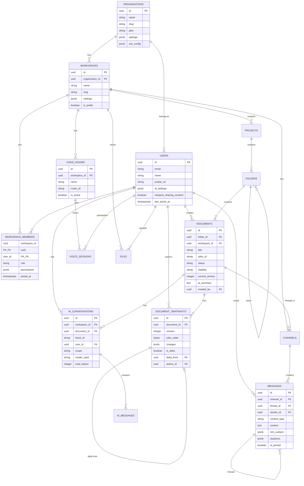

---

# 16. API Design

## 16.1 RESTful API 명세

```
Base URL: https://api.ameva.io/v1

인증: Bearer JWT Token
Content-Type: application/json
Rate Limit: 각 엔드포인트별 명시
```

### Documents API

```yaml
# 문서 API

GET /documents/{id}
  - 설명: 문서 조회 (블록 포함)
  - 권한: read
  - 응답: Document + Blocks[]
  - Cache: ETag 기반, 30초

POST /documents
  - 설명: 문서 생성
  - 바디: { folderId, title, templateId? }
  - 응답: Document
  - 이벤트: document.created → Kafka

PATCH /documents/{id}
  - 설명: 문서 메타데이터 업데이트
  - 바디: { title?, icon?, visibility? }
  - 응답: Document

DELETE /documents/{id}
  - 설명: 문서 삭제 (소프트)
  - 권한: delete
  - 이벤트: document.deleted → Kafka

GET /documents/{id}/versions
  - 설명: 버전 목록 조회
  - 파라미터: page, limit, authorId?
  - 응답: Snapshot[]

POST /documents/{id}/versions/{versionId}/restore
  - 설명: 버전 복원
  - 권한: edit
  - 응답: Document

GET /documents/{id}/versions/{a}/diff/{b}
  - 설명: 두 버전 간 diff
  - 응답: DiffResult

POST /documents/{id}/share
  - 설명: 공유 설정
  - 바디: { targets: [{type, id, permission}] }
  - 응답: ShareResult

POST /documents/{id}/export
  - 설명: 문서 내보내기
  - 바디: { format: 'pdf'|'docx'|'md'|'html' }
  - 응답: { jobId, estimatedTime }

GET /documents/export/jobs/{jobId}
  - 설명: 변환 상태 조회
  - 응답: { status, downloadUrl? }
```

### AI API

```yaml
# AI API (SSE 스트리밍)

POST /ai/block/assist
  - 설명: 블록 AI 처리
  - 바디: {
      action: AIAction,
      blockId: string,
      documentId: string,
      content: string,
      instruction?: string
    }
  - 응답: SSE Stream (text/event-stream)
  - Rate Limit: 60/min per user

POST /ai/document/chat
  - 설명: 문서 컨텍스트 AI 채팅
  - 바디: {
      documentId: string,
      message: string,
      history?: Message[]
    }
  - 응답: SSE Stream

POST /ai/workspace/search
  - 설명: 의미론적 검색
  - 바디: { query: string, limit?: number }
  - 응답: SearchResult[]

POST /ai/meeting/analyze
  - 설명: 회의 분석 요청
  - 바디: { voiceRoomId: string, sessionId: string }
  - 응답: { jobId }

GET /ai/meeting/results/{jobId}
  - 설명: 회의 분석 결과
  - 응답: MeetingAnalysis
```

### Voice API

```yaml
# Voice API (WebRTC 시그널링)

POST /voice/rooms
  - 설명: 음성 룸 생성
  - 바디: { name, maxMembers?, workspaceId }
  - 응답: VoiceRoom + routerRtpCapabilities

POST /voice/rooms/{id}/join
  - 설명: 음성 룸 참여
  - 바디: { rtpCapabilities }
  - 응답: { transportParams }

POST /voice/transport/connect
  - 설명: WebRTC Transport 연결
  - 바디: { transportId, dtlsParameters }

POST /voice/transport/produce
  - 설명: 미디어 스트림 전송 시작
  - 바디: { transportId, kind, rtpParameters }
  - 응답: { producerId }

POST /voice/transport/consume
  - 설명: 타 사용자 스트림 수신
  - 바디: { producerId, rtpCapabilities }
  - 응답: { consumerParams }
```

### WebSocket Events API

```typescript
// WebSocket 이벤트 명세

// 서버 → 클라이언트
interface ServerEvents {
  'presence:update': {
    userId: string;
    status: UserPresence;
  };
  
  'document:cursor': {
    userId: string;
    documentId: string;
    cursor: CursorPosition;
    color: string;
  };
  
  'chat:message': {
    channelId: string;
    message: Message;
  };
  
  'voice:speaking': {
    roomId: string;
    userId: string;
    isSpeaking: boolean;
    audioLevel: number;
  };
  
  'notification:new': {
    notification: Notification;
  };
  
  'document:snapshot': {
    documentId: string;
    version: number;
    authorId: string;
  };
}

// 클라이언트 → 서버
interface ClientEvents {
  'presence:heartbeat': {
    status: ActivityStatus;
    documentId?: string;
    blockId?: string;
  };
  
  'voice:speaking': {
    roomId: string;
    isSpeaking: boolean;
    audioLevel: number;
  };
  
  'viewport:update': {
    documentId: string;
    scrollTop: number;
    zoom: number;
  };
}
```

---

# 17. Event Flow

## 17.1 핵심 이벤트 플로우

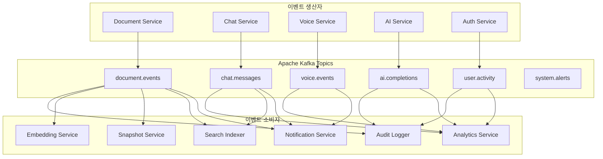

## 17.2 문서 편집 이벤트 체인

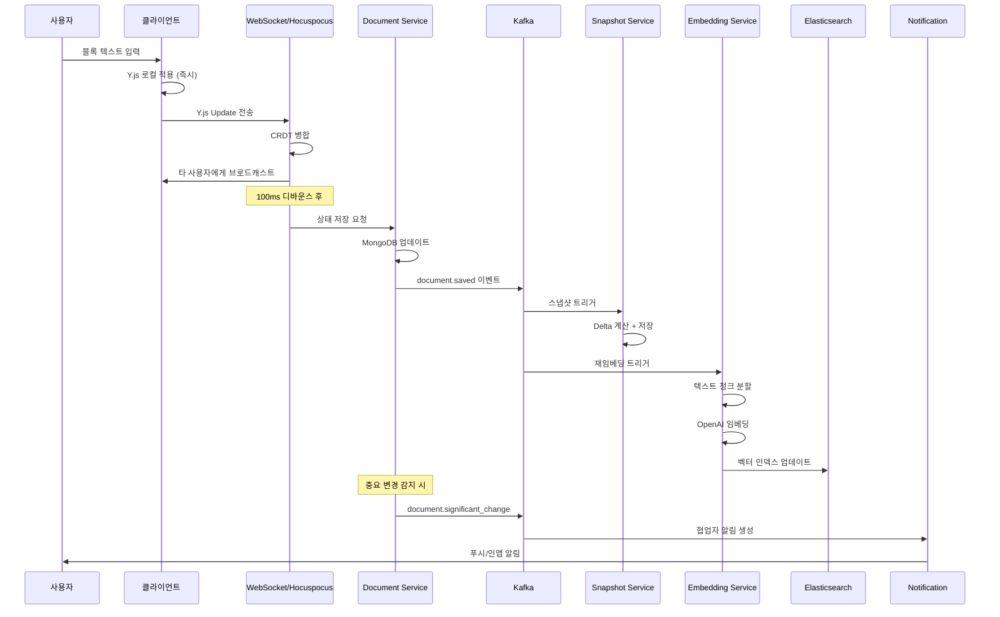

---

# 18. Sequence Diagrams

## 18.1 실시간 협업 시퀀스

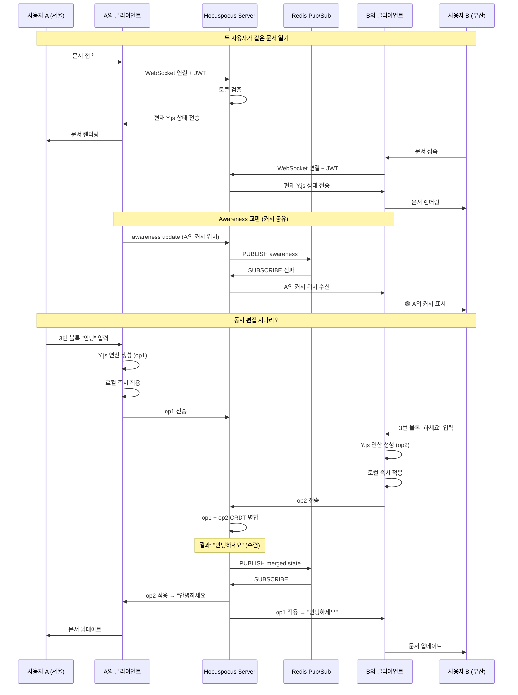

## 18.2 AI Block Assistant 시퀀스

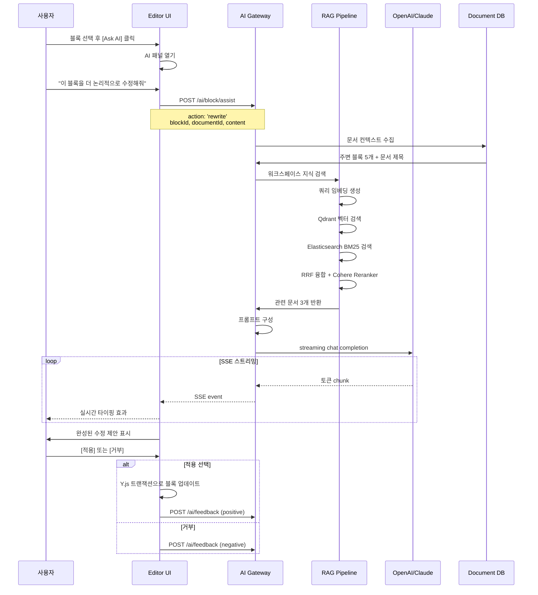

## 18.3 화면 공유 시퀀스

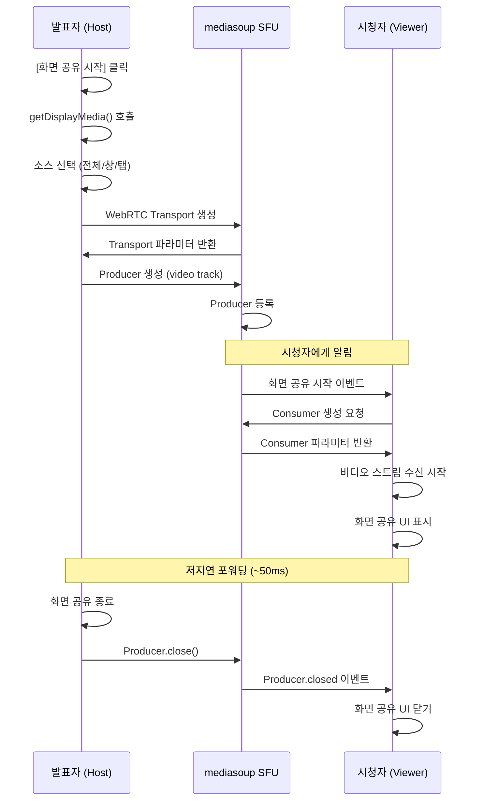

---

# 19. Folder Structure

```
ameva/
├── 📁 apps/
│   ├── 📁 desktop/                    # Electron 앱
│   │   ├── src/
│   │   │   ├── main/                  # Electron Main Process
│   │   │   │   ├── index.ts
│   │   │   │   ├── window-manager.ts
│   │   │   │   ├── tray-manager.ts
│   │   │   │   ├── auto-updater.ts
│   │   │   │   ├── ipc-handlers/
│   │   │   │   │   ├── file.handler.ts
│   │   │   │   │   ├── shortcut.handler.ts
│   │   │   │   │   └── native.handler.ts
│   │   │   │   └── native/
│   │   │   │       ├── notification.ts
│   │   │   │       └── deep-link.ts
│   │   │   └── preload/               # Electron Preload
│   │   │       └── index.ts
│   │   ├── electron-builder.yml
│   │   └── package.json
│   │
│   └── 📁 web/                        # Web/PWA 앱
│       ├── public/
│       │   ├── manifest.json
│       │   ├── service-worker.js
│       │   └── icons/
│       ├── src/
│       │   ├── main.tsx
│       │   ├── App.tsx
│       │   └── ...
│       └── vite.config.ts
│
├── 📁 packages/
│   ├── 📁 ui/                         # 공유 UI 컴포넌트
│   │   ├── src/
│   │   │   ├── components/
│   │   │   │   ├── Button/
│   │   │   │   ├── Modal/
│   │   │   │   ├── Dropdown/
│   │   │   │   ├── Avatar/
│   │   │   │   ├── Badge/
│   │   │   │   ├── Tooltip/
│   │   │   │   ├── Toast/
│   │   │   │   ├── Skeleton/
│   │   │   │   └── index.ts
│   │   │   ├── icons/
│   │   │   ├── styles/
│   │   │   │   ├── tokens.css
│   │   │   │   ├── reset.css
│   │   │   │   └── animations.css
│   │   │   └── hooks/
│   │   └── package.json
│   │
│   ├── 📁 editor/                     # 에디터 코어
│   │   ├── src/
│   │   │   ├── core/
│   │   │   │   ├── editor.ts          # TipTap 기반 에디터
│   │   │   │   ├── extensions/
│   │   │   │   │   ├── block-id.ts
│   │   │   │   │   ├── slash-command.ts
│   │   │   │   │   ├── drag-drop.ts
│   │   │   │   │   ├── ai-block.ts
│   │   │   │   │   ├── code-block.ts
│   │   │   │   │   ├── math-block.ts
│   │   │   │   │   ├── mermaid-block.ts
│   │   │   │   │   ├── canvas-block.ts
│   │   │   │   │   ├── database-view.ts
│   │   │   │   │   ├── table.ts
│   │   │   │   │   ├── callout.ts
│   │   │   │   │   ├── toggle.ts
│   │   │   │   │   ├── columns.ts
│   │   │   │   │   └── collaboration.ts
│   │   │   ├── blocks/
│   │   │   │   ├── TextBlock.tsx
│   │   │   │   ├── CodeBlock.tsx
│   │   │   │   ├── TableBlock.tsx
│   │   │   │   ├── MathBlock.tsx
│   │   │   │   ├── MermaidBlock.tsx
│   │   │   │   ├── CanvasBlock.tsx
│   │   │   │   ├── DatabaseBlock.tsx
│   │   │   │   ├── KanbanBlock.tsx
│   │   │   │   ├── TimelineBlock.tsx
│   │   │   │   ├── CalendarBlock.tsx
│   │   │   │   ├── CalloutBlock.tsx
│   │   │   │   ├── ToggleBlock.tsx
│   │   │   │   ├── ColumnsBlock.tsx
│   │   │   │   └── AIBlock.tsx
│   │   │   ├── ai/
│   │   │   │   ├── AIAssistant.tsx
│   │   │   │   ├── AIPanel.tsx
│   │   │   │   ├── AIChat.tsx
│   │   │   │   └── ai-client.ts
│   │   │   ├── collaboration/
│   │   │   │   ├── ydoc-store.ts
│   │   │   │   ├── cursor-manager.ts
│   │   │   │   ├── presence-overlay.tsx
│   │   │   │   └── awareness.ts
│   │   │   └── version/
│   │   │       ├── snapshot.ts
│   │   │       └── diff-viewer.tsx
│   │   └── package.json
│   │
│   ├── 📁 collab/                     # CRDT 공유 로직
│   ├── 📁 voice/                      # 음성 클라이언트
│   │   ├── src/
│   │   │   ├── voice-manager.ts
│   │   │   ├── audio-processor.ts
│   │   │   ├── vad.ts
│   │   │   ├── rnnoise.ts
│   │   │   └── mediasoup-client.ts
│   ├── 📁 types/                      # 공유 TypeScript 타입
│   ├── 📁 config/                     # 공유 설정
│   └── 📁 utils/                      # 공유 유틸리티
│
├── 📁 services/
│   ├── 📁 auth/                       # Auth Service
│   │   ├── src/
│   │   │   ├── index.ts
│   │   │   ├── routes/
│   │   │   ├── middleware/
│   │   │   └── providers/
│   │   │       ├── google.ts
│   │   │       ├── github.ts
│   │   │       └── saml.ts
│   │   ├── Dockerfile
│   │   └── package.json
│   │
│   ├── 📁 document/                   # Document Service
│   │   ├── src/
│   │   │   ├── index.ts
│   │   │   ├── routes/
│   │   │   ├── services/
│   │   │   │   ├── document.service.ts
│   │   │   │   ├── block.service.ts
│   │   │   │   └── permission.service.ts
│   │   │   ├── models/
│   │   │   └── repositories/
│   │   └── Dockerfile
│   │
│   ├── 📁 collaboration/              # CRDT 서버
│   │   ├── src/
│   │   │   └── index.ts              # Hocuspocus 서버
│   │   └── Dockerfile
│   │
│   ├── 📁 chat/                       # Chat Service
│   ├── 📁 voice/                      # Voice Service (mediasoup)
│   ├── 📁 ai/                         # AI Gateway (Python)
│   │   ├── main.py
│   │   ├── routers/
│   │   │   ├── block_ai.py
│   │   │   ├── document_ai.py
│   │   │   └── meeting_ai.py
│   │   ├── services/
│   │   │   ├── rag_pipeline.py
│   │   │   ├── llm_gateway.py
│   │   │   ├── embedding_service.py
│   │   │   └── stt_service.py
│   │   └── Dockerfile
│   │
│   ├── 📁 file/                       # File Service
│   ├── 📁 notification/               # Notification Service
│   ├── 📁 search/                     # Search Service
│   ├── 📁 version/                    # Version Service
│   └── 📁 presence/                   # Presence Service
│
├── 📁 infra/
│   ├── 📁 k8s/                        # Kubernetes 매니페스트
│   │   ├── base/
│   │   ├── overlays/
│   │   │   ├── development/
│   │   │   ├── staging/
│   │   │   └── production/
│   │   └── helm/
│   ├── 📁 terraform/                  # IaC
│   │   ├── aws/
│   │   ├── gcp/
│   │   └── modules/
│   └── 📁 monitoring/
│       ├── prometheus/
│       ├── grafana/
│       └── alertmanager/
│
├── 📁 .github/
│   ├── workflows/
│   │   ├── ci.yml
│   │   ├── cd-staging.yml
│   │   ├── cd-production.yml
│   │   └── desktop-release.yml
│
├── turbo.json                         # Turborepo 설정
├── pnpm-workspace.yaml
├── package.json
└── docker-compose.yml
```

---

# 20. Security Architecture

## 20.1 보안 레이어 구조

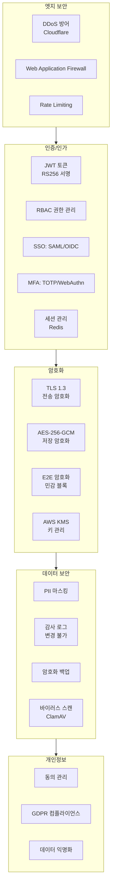

## 20.2 JWT 토큰 설계

```typescript
// JWT 페이로드 구조
interface JWTPayload {
  // 표준 클레임
  sub: string;       // userId
  iat: number;       // 발행 시각
  exp: number;       // 만료 (액세스: 15분)
  jti: string;       // 토큰 고유 ID (블랙리스트용)
  
  // AMEVA 클레임
  email: string;
  workspaces: string[];  // 접근 가능한 워크스페이스
  orgId: string;
  roles: Record<string, string>;  // workspaceId -> role
  
  // 보안
  sessionId: string;
  deviceId: string;
  ipHash: string;    // IP 해시 (토큰 도용 탐지)
}

// 토큰 회전 전략
class TokenRotationStrategy {
  ACCESS_TOKEN_TTL = 15 * 60;      // 15분
  REFRESH_TOKEN_TTL = 30 * 24 * 60 * 60;  // 30일
  
  async rotateRefreshToken(refreshToken: string): Promise<TokenPair> {
    const payload = await this.verify(refreshToken);
    
    // 이미 사용된 Refresh Token 탐지 (Refresh Token Rotation)
    const isUsed = await this.redis.get(`rt:${payload.jti}`);
    if (isUsed) {
      // 토큰 재사용 = 탈취 의심 → 모든 세션 무효화
      await this.revokeAllSessions(payload.sub);
      throw new SecurityError('Token reuse detected');
    }
    
    // 이전 토큰 블랙리스트
    await this.redis.setex(`rt:${payload.jti}`, this.REFRESH_TOKEN_TTL, 'used');
    
    return this.issueTokenPair(payload.sub);
  }
}
```

## 20.3 RBAC 권한 매트릭스

| 권한 | Owner | Admin | Member | Viewer | Guest |
|------|-------|-------|--------|--------|-------|
| 문서 생성 | ✅ | ✅ | ✅ | ❌ | ❌ |
| 문서 편집 | ✅ | ✅ | ✅ | ❌ | ❌ |
| 문서 읽기 | ✅ | ✅ | ✅ | ✅ | ✅ |
| 문서 삭제 | ✅ | ✅ | 본인만 | ❌ | ❌ |
| 멤버 초대 | ✅ | ✅ | ❌ | ❌ | ❌ |
| 멤버 제거 | ✅ | ✅ | ❌ | ❌ | ❌ |
| AI 사용 | ✅ | ✅ | ✅ | ✅ | ❌ |
| 음성 채팅 | ✅ | ✅ | ✅ | ✅ | ❌ |
| 파일 내보내기 | ✅ | ✅ | ✅ | ✅ | ❌ |
| 감사 로그 열람 | ✅ | ✅ | ❌ | ❌ | ❌ |
| 청구 관리 | ✅ | ❌ | ❌ | ❌ | ❌ |

## 20.4 데이터 암호화 전략

```typescript
// E2E 암호화 (민감 블록)
class BlockEncryptionService {
  // 문서별 AES-256 키 생성
  async generateDocumentKey(documentId: string): Promise<CryptoKey> {
    const key = await crypto.subtle.generateKey(
      { name: 'AES-GCM', length: 256 },
      true,
      ['encrypt', 'decrypt']
    );
    
    // 키를 AWS KMS로 래핑 (Key Wrapping)
    const wrappedKey = await this.kms.wrapKey(documentId, key);
    await this.keyStore.save(documentId, wrappedKey);
    
    return key;
  }
  
  // 블록 암호화
  async encryptBlock(blockContent: string, documentId: string): Promise<EncryptedBlock> {
    const key = await this.getDocumentKey(documentId);
    const iv = crypto.getRandomValues(new Uint8Array(12));
    
    const encrypted = await crypto.subtle.encrypt(
      { name: 'AES-GCM', iv },
      key,
      new TextEncoder().encode(blockContent)
    );
    
    return {
      ciphertext: Buffer.from(encrypted).toString('base64'),
      iv: Buffer.from(iv).toString('base64'),
      keyId: documentId,
      algorithm: 'AES-256-GCM',
    };
  }
}
```

---

# 21. Scaling Strategy

## 21.1 수평 확장 설계

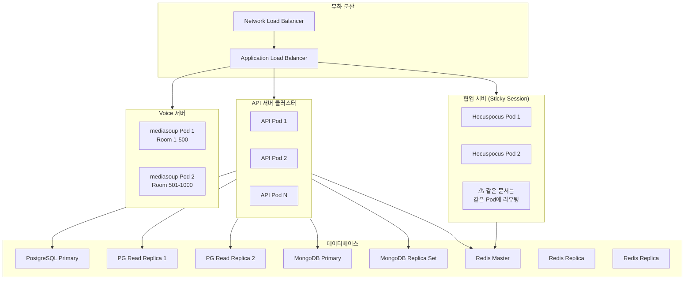

## 21.2 HPA 설정

```yaml
# document-service HPA
apiVersion: autoscaling/v2
kind: HorizontalPodAutoscaler
metadata:
  name: document-service-hpa
spec:
  scaleTargetRef:
    apiVersion: apps/v1
    kind: Deployment
    name: document-service
  minReplicas: 3
  maxReplicas: 50
  metrics:
  - type: Resource
    resource:
      name: cpu
      target:
        type: Utilization
        averageUtilization: 65
  - type: Resource
    resource:
      name: memory
      target:
        type: Utilization
        averageUtilization: 75
  - type: External
    external:
      metric:
        name: active_connections
      target:
        type: AverageValue
        averageValue: "1000"
  behavior:
    scaleUp:
      stabilizationWindowSeconds: 30  # 빠른 스케일 업
    scaleDown:
      stabilizationWindowSeconds: 300  # 안전한 스케일 다운
```

## 21.3 대규모 동시 접속 처리

```
목표: 100,000 동시 접속

계산:
- WebSocket 연결: 100,000개
- 각 Pod: 10,000 connections max
- 필요 Pod: 10개 (일반) → 최대 50개 (피크)

협업 서버 (Hocuspocus):
- 문서당 평균 3명 협업
- 동시 활성 문서: 30,000개
- Redis Pub/Sub로 Pod 간 동기화
- 필요 Pod: 30개 (문서당 1 채널)

음성 서버 (mediasoup):
- 음성 룸당 CPU: ~0.5 vCPU
- 동시 룸: 5,000개 가정
- 필요: 2,500 vCPU → GPU Node Pool
- 각 Pod: 500 룸
- 필요 Pod: 10개

Redis Cluster:
- 노드: 6개 (3 Master + 3 Replica)
- 메모리: 각 16GB
- Presence 데이터: ~1KB/user → 100MB/100K users

PostgreSQL:
- Primary: r6g.4xlarge (16 vCPU, 128GB)
- Read Replicas: 4개 (읽기 부하 분산)
- 연결 풀: PgBouncer (각 서비스별)
```

---

# 22. Deployment Strategy

## 22.1 CI/CD 파이프라인

```mermaid
flowchart LR
    subgraph Dev["개발"]
        CODE[코드 작성]
        PR[PR 생성]
    end
    
    subgraph CI["CI Pipeline (GitHub Actions)"]
        LINT[린트 + 타입 체크]
        TEST[유닛 테스트]
        E2E[E2E 테스트<br/>Playwright]
        BUILD[Docker 빌드]
        SCAN[보안 스캔<br/>Snyk + Trivy]
    end
    
    subgraph Staging["스테이징 배포"]
        STG_DEPLOY[자동 배포]
        STG_TEST[통합 테스트]
        STG_REVIEW[팀 리뷰]
    end
    
    subgraph Prod["프로덕션 배포"]
        APPROVE[수동 승인]
        CANARY[카나리 배포 5%]
        MONITOR[15분 모니터링]
        ROLLOUT[점진적 롤아웃]
        FULL[100% 배포]
    end
    
    CODE --> PR
    PR --> LINT
    LINT --> TEST
    TEST --> E2E
    E2E --> BUILD
    BUILD --> SCAN
    
    SCAN --> STG_DEPLOY
    STG_DEPLOY --> STG_TEST
    STG_TEST --> STG_REVIEW
    
    STG_REVIEW --> APPROVE
    APPROVE --> CANARY
    CANARY --> MONITOR
    MONITOR -->|문제 없음| ROLLOUT
    MONITOR -->|에러 감지| ROLLBACK
    ROLLOUT --> FULL
```

## 22.2 Blue-Green / Canary 배포

```yaml
# Argo Rollouts 카나리 배포 설정
apiVersion: argoproj.io/v1alpha1
kind: Rollout
metadata:
  name: document-service
spec:
  replicas: 10
  strategy:
    canary:
      steps:
      - setWeight: 5     # 5% 트래픽
      - pause: {duration: 5m}
      - analysis:
          templates:
          - templateName: success-rate
      - setWeight: 25
      - pause: {duration: 10m}
      - setWeight: 50
      - pause: {duration: 10m}
      - setWeight: 100
      
  # 자동 롤백 조건
  analysis:
    successCondition: "result[0] >= 0.99"  # 99% 성공률
    failureCondition: "result[0] < 0.95"   # 95% 미만시 롤백
```

## 22.3 멀티 리전 전략

```
리전 배포 전략:
├── Primary Region: ap-northeast-2 (서울)
│   └── 한국, 일본, 동남아 사용자
│
├── Secondary Region: us-east-1 (버지니아)
│   └── 미국, 유럽 사용자 (지연 최소화)
│
├── Tertiary Region: eu-west-1 (아일랜드)
│   └── EU GDPR 데이터 주권
│
데이터 동기화:
- PostgreSQL: Active-Passive 복제 (Primary: 서울)
- MongoDB: 글로벌 클러스터 (리전별 로컬 읽기)
- S3: Cross-Region Replication
- Redis: 리전별 독립 클러스터 (Presence는 로컬)

DNS: GeoDNS로 가장 가까운 리전 라우팅
```

---

# 23. MVP Scope

## MVP (0-3개월)

**목표**: 핵심 가치 검증, 초기 사용자 확보

### 포함 기능

```
✅ 기본 Block Editor (TipTap 기반)
   - Paragraph, Heading, Code, Table, List
   - Slash Command (기본 10개)
   - Drag & Drop 블록 이동
   
✅ Y.js 실시간 협업
   - Live Cursor (최대 5명)
   - 텍스트 동시 편집
   - 오프라인 지원 (기본)
   
✅ 기본 AI Assistant
   - GPT-4o-mini 연동
   - 생성, 수정, 요약, 번역
   - 블록 단위 처리
   
✅ 워크스페이스 구조
   - Workspace > Project > Folder > Document
   - 기본 RBAC (Owner/Member/Viewer)
   
✅ 텍스트 채팅
   - DM + 그룹 채널
   - 기본 이모지, 파일 첨부
   
✅ 버전 히스토리
   - 자동 스냅샷 (1시간 단위)
   - 버전 목록 조회
   
✅ 인증
   - 이메일/비밀번호
   - Google OAuth
   
✅ 파일 업로드/다운로드
   - 이미지, PDF, 기본 포맷
   
✅ Electron 기본 앱
   - Mac + Windows
   - 웹 래퍼 수준
```

### 제외 기능 (MVP)
```
❌ 음성 채팅 (Beta에서)
❌ 화면 공유 (Beta에서)
❌ Meeting AI (Beta에서)
❌ 코드 실행 (Beta에서)
❌ Infinite Canvas (Beta에서)
❌ 파일 변환 (Beta에서)
❌ SSO/SAML (Commercial에서)
```

### MVP 기술 스택 (단순화)
```
Frontend: React + TipTap + Zustand
Backend: Node.js (모노리스) → 마이크로서비스로 분리 예정
DB: PostgreSQL + Redis
Realtime: Hocuspocus (단일 인스턴스)
AI: OpenAI API
Deploy: Railway/Render (초기 단순화)
```

---

# 24. Beta Scope

## Beta (4-9개월)

**목표**: 핵심 차별화 기능 구현, PMF 검증

### 추가 기능

```
✅ 음성 채팅 (mediasoup SFU)
   - Multi-user Voice Room
   - Noise Suppression, Echo Cancellation
   - Speaking Indicator
   - Push-to-Talk
   
✅ 화면 공유
   - 전체 화면 / 창 / 탭
   - 다중 시청자
   
✅ 고급 블록 타입
   - Mermaid 다이어그램
   - Math Formula (KaTeX)
   - Infinite Canvas (Excalidraw)
   - Callout, Toggle, Columns
   - Database View (Table/Board/List)
   - Kanban Board
   
✅ 코드 실행 (Pyodide/QuickJS)
   - Python, JavaScript 인브라우저 실행
   - HTML Preview
   
✅ Meeting AI
   - STT (Whisper)
   - 자동 회의록
   - Action Item 추출
   
✅ 파일 변환
   - Markdown ↔ PDF, DOCX, HTML
   - Excel, PPTX 기본 지원
   
✅ RAG 기반 Workspace AI
   - 워크스페이스 전체 시맨틱 검색
   - 문서 단위 AI Chat
   
✅ Presence System
   - Online/Offline/Idle
   - 현재 문서 위치 표시
   
✅ 고급 버전 관리
   - Git-Like Diff 뷰어
   - Time Travel
   - 버전 비교
   
✅ 마이크로서비스 전환
   - 서비스 분리
   - Kubernetes 배포
   
✅ Git Integration
   - GitHub/GitLab 연동
   - 코드 블록 → 자동 PR
```

---

# 25. Commercial Scope

## Commercial (10-18개월)

**목표**: 엔터프라이즈 진출, 상용화

### 추가 기능

```
✅ 엔터프라이즈 인증
   - SAML 2.0 SSO
   - LDAP/AD 연동
   - WebAuthn (패스키)
   - IP 화이트리스트
   
✅ 고급 AI 기능
   - 로컬 LLM (Ollama) 지원 (프라이버시 모드)
   - 멀티모달 (이미지 분석)
   - AI 에이전트 (자율 문서 생성)
   - 커스텀 AI 모델 파인튜닝
   
✅ 엔터프라이즈 관리
   - 중앙화된 관리자 대시보드
   - 사용량 분석 및 리포트
   - 컴플라이언스 대시보드
   - 감사 로그 내보내기
   
✅ 고급 보안
   - E2E 암호화 (블록 레벨)
   - DLP (데이터 유출 방지)
   - 데이터 잔존 정책
   - SOC 2 Type II 인증
   - GDPR/CCPA 완전 지원
   
✅ 고급 통합
   - Jira, Linear 연동
   - Salesforce, HubSpot
   - Zapier, Make (자동화)
   - Public REST API
   - Webhook 지원
   
✅ 화이트라벨링
   - 커스텀 도메인
   - 브랜드 커스터마이징
   - Self-hosted 옵션
   
✅ 고급 협업
   - Guest 링크 공유
   - 공개 페이지
   - 임베드 공유
   
✅ 오프라인 우선 데스크톱
   - 완전한 로컬 모드
   - 선택적 동기화
   - 로컬 암호화
   
✅ 멀티 리전 지원
   - EU 데이터 리전
   - 리전별 데이터 격리
```

### 가격 정책

| 플랜 | 가격 | 주요 기능 |
|------|------|-----------|
| Free | $0 | 1 워크스페이스, 5명, 100 AI 요청/월 |
| Pro | $12/user/월 | 무제한 워크스페이스, 1000 AI 요청/월 |
| Business | $25/user/월 | 고급 AI, 화면 공유, 회의 AI |
| Enterprise | 협의 | SSO, SLA, 전담 지원, Self-hosted |

---

# 26. Risk Analysis

## 26.1 기술적 리스크

| 리스크 | 심각도 | 가능성 | 대응 전략 |
|--------|--------|--------|-----------|
| CRDT 성능 (초대형 문서) | 높음 | 중간 | Y.js subdoc 분할, 블록 레이지 로딩 |
| WebRTC 호환성 | 중간 | 낮음 | mediasoup 표준화, TURN 서버 |
| LLM API 가용성 | 높음 | 중간 | 다중 모델 폴백, 로컬 Ollama |
| 실시간 스케일링 | 높음 | 중간 | Sticky Session + Redis 샤딩 |
| 오프라인 병합 충돌 | 중간 | 낮음 | CRDT 수학적 보장, 사용자 알림 |
| AI 비용 폭발 | 높음 | 높음 | Rate Limiting, 토큰 버짓, 캐싱 |
| 데이터 유출 | 매우 높음 | 낮음 | E2E 암호화, 감사 로그, 보안 리뷰 |

## 26.2 비즈니스 리스크

| 리스크 | 대응 전략 |
|--------|-----------|
| Notion/Confluence 방어 | 독보적 AI + 실시간 기능 강조 |
| 지나친 기능 범위 | MVP 엄격 제한, 단계별 출시 |
| 팀 실력 부족 | 핵심 오픈소스 레버리지 (Y.js, TipTap, mediasoup) |
| 규제 (AI/데이터) | 법무 검토, Privacy by Design |

---

# 27. Technical Challenges

## 27.1 대형 문서 CRDT 성능

**문제**: Y.js는 연산 히스토리를 메모리에 보관 → 수만 번 편집 시 메모리 폭발

**해결책**:
```typescript
// Y.js Garbage Collection + Snapshot 전략
const ydoc = new Y.Doc({
  gc: true,           // GC 활성화
  gcFilter: (item) => {
    // 중요 마커는 GC 제외
    return !item.parent?.key?.startsWith('_important_');
  }
});

// 주기적 Compact Snapshot (전체 상태 저장 후 히스토리 정리)
async function compactDocument(documentId: string) {
  const state = Y.encodeStateAsUpdateV2(ydoc);  // 현재 상태 스냅샷
  await db.replaceDocumentState(documentId, state);  // 저장
  ydoc.store.clients.clear();  // 히스토리 정리
}
```

## 27.2 한국어 실시간 입력 처리

**문제**: IME 입력(한글, 중국어, 일본어)에서 Y.js 충돌 발생

**해결책**:
```typescript
// IME 입력 완료 후에만 CRDT 적용
const editor = useEditor({
  extensions: [Collaboration.configure({ document: ydoc })],
  
  editorProps: {
    handleDOMEvents: {
      compositionstart: () => {
        // IME 시작: CRDT 업데이트 일시 중지
        ydoc.transact(() => {}, 'ime-lock');
        return false;
      },
      compositionend: (view, event) => {
        // IME 완료: 최종 텍스트로 CRDT 업데이트
        const composedText = (event as CompositionEvent).data;
        applyIMEUpdate(view, composedText);
        return false;
      },
    },
  },
});
```

## 27.3 Electron IPC 보안

**문제**: Electron Main/Renderer 프로세스 간 IPC에서 보안 취약점

**해결책**:
```typescript
// preload.ts - 안전한 IPC 브릿지
const { contextBridge, ipcRenderer } = require('electron');

// allowlist 기반 노출 (window.electronAPI만 노출)
contextBridge.exposeInMainWorld('electronAPI', {
  // 파일 시스템 접근 (검증된 경로만)
  saveFile: (data: SaveFileRequest) => {
    validateSaveRequest(data);  // 경로 traversal 방지
    return ipcRenderer.invoke('file:save', data);
  },
  
  // 네이티브 알림
  showNotification: (options: NotificationOptions) => {
    sanitizeNotificationOptions(options);
    return ipcRenderer.invoke('notification:show', options);
  },
});

// Node.js API 완전 차단
// nodeIntegration: false (기본값)
// contextIsolation: true (필수)
// sandbox: true (추가 격리)
```

---

# 28. Screens Design Specification

## 28.1 메인 에디터 화면

```
화면: Document Editor
URL: /workspace/{wid}/document/{did}

레이아웃:
├── TopBar (48px, fixed)
│   ├── 좌: [뒤로] [워크스페이스명 > 프로젝트 > 문서명]
│   ├── 중: [현재 편집 중인 사용자 아바타 x3]
│   └── 우: [공유] [내보내기] [더보기 ...]
│
├── Sidebar (240px, resizable)
│   ├── [검색 바]
│   ├── [워크스페이스 트리 네비게이션]
│   ├── [CHANNELS 섹션]
│   └── [VOICE 섹션]
│
├── Editor Area (flex-grow)
│   ├── Document Header
│   │   ├── [아이콘/이모지 선택]
│   │   ├── [표지 이미지 (선택적)]
│   │   └── [제목 입력 (h1, placeholder: "제목 없음")]
│   │
│   ├── Block List
│   │   ├── Block 1 [드래그 핸들 ⠿] [콘텐츠] [⊕ 추가] [AI ✨]
│   │   ├── Block 2 [드래그 핸들 ⠿] [콘텐츠] [⊕ 추가] [AI ✨]
│   │   └── [+ 새 블록 추가 (클릭 또는 /)]
│   │
│   └── 하단 여백 (클릭 시 새 블록)
│
└── AI Panel (320px, 토글 가능)
    ├── [문서 AI 채팅]
    ├── [선택된 블록 분석]
    └── [워크스페이스 검색]

인터랙션:
- '/' 입력 시 Slash Command 팝업 (중앙 상단)
- 블록 호버 시 [드래그 핸들], [추가], [AI] 버튼 표시
- 블록 선택 시 Floating Toolbar 표시
- 타 사용자 커서: 색상 구분 + 이름 툴팁
- 자동 저장: 1초 디바운스 후 저장 표시
```

## 28.2 Voice Room 화면

```
화면: Voice Room (오버레이)
컴포넌트: floating-voice-panel

상태 1: 최소화 (기본)
├── [음성 아이콘] [현재 방 이름] [3명 ●]
└── [마이크] [스피커] [종료]

상태 2: 확장
├── 참가자 그리드
│   ├── [아바타] [이름] [음성 레벨 바] [🔇/🔊]
│   │   └── 발화 중: 아바타 주변 녹색 링 애니메이션
│   └── ...
├── 화면 공유 뷰 (공유 중인 경우)
└── 컨트롤 바
    ├── [🎙 마이크 토글]
    ├── [🔊 스피커 토글]
    ├── [🖥 화면 공유]
    ├── [⚙ 오디오 설정]
    └── [📞 종료]

디자인:
- Glass Morphism 패널 (backdrop-filter: blur(24px))
- Draggable + Resizable
- 화면 하단 우측 기본 위치
- 드래그하여 화면 어디든 이동 가능
```

## 28.3 AI Block Assistant 화면

```
화면: AI Assistant (블록 우측 패널 또는 인라인)

트리거: 블록 우측 [✨ Ask AI] 버튼 클릭

UI 구성:
┌────────────────────────────────────┐
│ ✨ AI Assistant                    │
│ ─────────────────────────────────  │
│ 현재 블록: "3번째 단락"            │
│                                    │
│ [🔄 다시 쓰기]  [📝 확장]         │
│ [🗜 요약]      [🌐 번역]          │
│ [💡 개선]      [🔍 사실 검증]     │
│ [💻 코드 생성] [📋 회의 정리]     │
│                                    │
│ ─── 직접 입력 ───────────────────  │
│ [원하는 내용을 입력하세요...]      │
│                           [전송 →] │
│                                    │
│ ─── AI 응답 ─────────────────────  │
│ ▋ 스트리밍 응답 표시 중...         │
│                                    │
│ [✅ 적용] [🔄 재생성] [✗ 닫기]   │
└────────────────────────────────────┘

애니메이션:
- 패널 등장: slide-in from right (220ms spring)
- 스트리밍: 타이핑 커서 효과
- 적용 시: 블록 flash 애니메이션
```

## 28.4 버전 히스토리 화면

```
화면: Version History
경로: 우측 패널 또는 전체 화면 모달

레이아웃:
┌────────────────────────────────────────────────────┐
│  ← 현재 문서로                    버전 히스토리    │
├───────────────────┬────────────────────────────────┤
│  버전 목록        │  변경 내용 (diff)               │
│                   │                                │
│  ● v15 (현재)     │  ┌─ v14 vs v15 ─────────────┐ │
│    홍길동 | 방금  │  │ + 추가된 내용 (초록)       │ │
│                   │  │ - 삭제된 내용 (빨강)       │ │
│  ● v14            │  │   변경 없는 내용 (회색)    │ │
│    김영희 | 1시간 │  └──────────────────────────┘ │
│                   │                                │
│  ● v13            │  블록 단위 변경 표시           │
│    AI | 2시간     │  ├ [Block 3] 제목 변경         │
│                   │  ├ [Block 7] 새 블록 추가      │
│  ● v12 ──────     │  └ [Block 12] 삭제             │
│    자동 저장      │                                │
│                   │  [이 버전으로 복원]            │
│  [더 불러오기]    │  [이 버전 내보내기]            │
└───────────────────┴────────────────────────────────┘
```

---

# 29. Component Design Specification

## 29.1 컴포넌트 계층 구조

```
AMEVA Component Tree:

<App>
├── <AuthProvider>          // JWT + 세션 관리
├── <ThemeProvider>         // Dark/Light 테마
├── <WorkspaceProvider>     // 워크스페이스 컨텍스트
├── <PresenceProvider>      // 실시간 Presence
├── <VoiceProvider>         // 음성 채팅 상태
│
└── <Layout>
    ├── <TopBar>
    │   ├── <WorkspaceSwitcher>
    │   ├── <GlobalSearch>
    │   ├── <NotificationBell>
    │   └── <UserMenu>
    │
    ├── <Sidebar>
    │   ├── <DocumentTree>
    │   │   ├── <WorkspaceItem>
    │   │   ├── <ProjectItem>
    │   │   ├── <FolderItem>
    │   │   └── <DocumentItem>
    │   ├── <ChannelList>
    │   └── <VoiceRoomList>
    │
    ├── <MainContent>
    │   ├── <DocumentEditor>
    │   │   ├── <DocumentHeader>
    │   │   ├── <BlockList>
    │   │   │   └── <Block> (다형성)
    │   │   │       ├── <TextBlock>
    │   │   │       ├── <CodeBlock>
    │   │   │       │   └── <CodeExecutor>
    │   │   │       ├── <TableBlock>
    │   │   │       ├── <MermaidBlock>
    │   │   │       ├── <CanvasBlock>
    │   │   │       ├── <DatabaseBlock>
    │   │   │       │   ├── <TableView>
    │   │   │       │   ├── <KanbanView>
    │   │   │       │   └── <CalendarView>
    │   │   │       └── <AIBlock>
    │   │   ├── <SlashCommand>
    │   │   ├── <FloatingToolbar>
    │   │   ├── <PresenceOverlay>
    │   │   │   ├── <RemoteCursor>
    │   │   │   └── <SelectionHighlight>
    │   │   └── <CollaborationBar>
    │   │
    │   ├── <ChatView>
    │   │   ├── <ChannelHeader>
    │   │   ├── <MessageList>
    │   │   │   └── <Message>
    │   │   │       ├── <MessageContent>
    │   │   │       ├── <MessageReactions>
    │   │   │       └── <MessageThread>
    │   │   └── <MessageComposer>
    │   │
    │   └── <MeetingView>
    │
    └── <AIPanel>
        ├── <AIChat>
        ├── <AIBlockSuggestions>
        └── <WorkspaceSearch>
```

## 29.2 핵심 컴포넌트 상세

### Block 컴포넌트 (다형성)

```typescript
// Block.tsx

interface BlockProps {
  id: string;
  type: BlockType;
  content: BlockContent;
  isSelected: boolean;
  isFocused: boolean;
  depth: number;        // 중첩 레벨
  index: number;        // 현재 위치
  totalBlocks: number;
  
  // 협업
  remoteSelections: RemoteSelection[];
  remoteCursors: RemoteCursor[];
  
  // 콜백
  onChange: (content: BlockContent) => void;
  onAddBlock: (type: BlockType, afterId: string) => void;
  onDeleteBlock: (id: string) => void;
  onMoveBlock: (id: string, newIndex: number) => void;
  onAIRequest: (action: AIAction) => void;
}

const Block: React.FC<BlockProps> = (props) => {
  const blockRef = useRef<HTMLDivElement>(null);
  const [isHovered, setIsHovered] = useState(false);
  const [showAIPanel, setShowAIPanel] = useState(false);
  
  // 드래그 앤 드롭 (dnd-kit)
  const { attributes, listeners, setNodeRef, transform, isDragging } = 
    useSortable({ id: props.id });
  
  const BlockComponent = BLOCK_REGISTRY[props.type];
  
  return (
    <div
      ref={setNodeRef}
      className={cn(
        'block-wrapper',
        isDragging && 'block-dragging',
        props.isSelected && 'block-selected',
      )}
      style={{ transform: CSS.Transform.toString(transform) }}
      onMouseEnter={() => setIsHovered(true)}
      onMouseLeave={() => setIsHovered(false)}
    >
      {/* 드래그 핸들 */}
      <AnimatePresence>
        {isHovered && (
          <motion.div
            className="block-handle"
            initial={{ opacity: 0, x: -8 }}
            animate={{ opacity: 1, x: 0 }}
            exit={{ opacity: 0, x: -8 }}
            {...listeners}
            {...attributes}
          >
            ⠿
          </motion.div>
        )}
      </AnimatePresence>
      
      {/* 실제 블록 콘텐츠 */}
      <BlockComponent {...props} />
      
      {/* 원격 커서/선택 오버레이 */}
      {props.remoteCursors.map(cursor => (
        <RemoteCursorOverlay key={cursor.userId} cursor={cursor} />
      ))}
      
      {/* AI 버튼 */}
      <AnimatePresence>
        {isHovered && (
          <motion.button
            className="ai-trigger-btn"
            onClick={() => setShowAIPanel(true)}
            initial={{ opacity: 0, scale: 0.8 }}
            animate={{ opacity: 1, scale: 1 }}
            exit={{ opacity: 0, scale: 0.8 }}
          >
            ✨
          </motion.button>
        )}
      </AnimatePresence>
      
      {/* AI 패널 */}
      <AnimatePresence>
        {showAIPanel && (
          <AIBlockPanel
            blockId={props.id}
            blockContent={props.content}
            onClose={() => setShowAIPanel(false)}
            onApply={(newContent) => props.onChange(newContent)}
          />
        )}
      </AnimatePresence>
    </div>
  );
};

// 블록 레지스트리 (확장 가능)
const BLOCK_REGISTRY: Record<BlockType, React.ComponentType<BlockProps>> = {
  paragraph: TextBlock,
  heading: HeadingBlock,
  code: CodeBlock,
  table: TableBlock,
  math: MathBlock,
  mermaid: MermaidBlock,
  canvas: CanvasBlock,
  database: DatabaseBlock,
  kanban: KanbanBlock,
  timeline: TimelineBlock,
  calendar: CalendarBlock,
  callout: CalloutBlock,
  toggle: ToggleBlock,
  columns: ColumnsBlock,
  ai_generated: AIGeneratedBlock,
  image: ImageBlock,
  embed: EmbedBlock,
};
```

### Slash Command 컴포넌트

```typescript
// SlashCommand.tsx

const SLASH_COMMANDS: SlashCommandGroup[] = [
  {
    group: '기본 블록',
    commands: [
      { id: 'paragraph', icon: '📝', label: '텍스트', desc: '일반 텍스트' },
      { id: 'heading1', icon: 'H1', label: '제목 1', desc: '큰 제목' },
      { id: 'heading2', icon: 'H2', label: '제목 2', desc: '중간 제목' },
      { id: 'heading3', icon: 'H3', label: '제목 3', desc: '소제목' },
      { id: 'code', icon: '💻', label: '코드', desc: '코드 블록' },
      { id: 'table', icon: '📊', label: '표', desc: '데이터 테이블' },
    ],
  },
  {
    group: 'AI',
    commands: [
      { id: 'ai_generate', icon: '✨', label: 'AI 생성', desc: 'AI로 내용 생성' },
      { id: 'ai_template', icon: '📋', label: 'AI 템플릿', desc: '스마트 템플릿' },
    ],
  },
  {
    group: '다이어그램',
    commands: [
      { id: 'mermaid', icon: '🗺', label: 'Mermaid', desc: '플로우차트/시퀀스' },
      { id: 'math', icon: '∑', label: '수식', desc: 'LaTeX 수식' },
      { id: 'canvas', icon: '🎨', label: 'Canvas', desc: '자유 캔버스' },
    ],
  },
  {
    group: '데이터베이스',
    commands: [
      { id: 'kanban', icon: '📌', label: '칸반', desc: '칸반 보드' },
      { id: 'timeline', icon: '📅', label: '타임라인', desc: '프로젝트 타임라인' },
      { id: 'calendar', icon: '🗓', label: '캘린더', desc: '달력 뷰' },
    ],
  },
];

const SlashCommand: React.FC = () => {
  const [query, setQuery] = useState('');
  const [position, setPosition] = useState({ x: 0, y: 0 });
  const [selectedIndex, setSelectedIndex] = useState(0);
  
  const filtered = useMemo(() => 
    SLASH_COMMANDS
      .map(group => ({
        ...group,
        commands: group.commands.filter(c => 
          c.label.includes(query) || c.desc.includes(query)
        )
      }))
      .filter(g => g.commands.length > 0),
    [query]
  );
  
  return (
    <motion.div
      className="slash-command-popup"
      style={{ left: position.x, top: position.y }}
      initial={{ opacity: 0, y: -8 }}
      animate={{ opacity: 1, y: 0 }}
      exit={{ opacity: 0, y: -8 }}
    >
      <div className="slash-search">
        <input
          autoFocus
          value={query}
          onChange={e => setQuery(e.target.value)}
          placeholder="블록 유형 검색..."
        />
      </div>
      
      <div className="slash-list">
        {filtered.map(group => (
          <div key={group.group} className="slash-group">
            <div className="slash-group-label">{group.group}</div>
            {group.commands.map(cmd => (
              <button
                key={cmd.id}
                className="slash-item"
                onClick={() => insertBlock(cmd.id)}
              >
                <span className="slash-icon">{cmd.icon}</span>
                <div>
                  <div className="slash-label">{cmd.label}</div>
                  <div className="slash-desc">{cmd.desc}</div>
                </div>
              </button>
            ))}
          </div>
        ))}
      </div>
    </motion.div>
  );
};
```

---

# 30. Full Development Roadmap

## 30.1 전체 타임라인

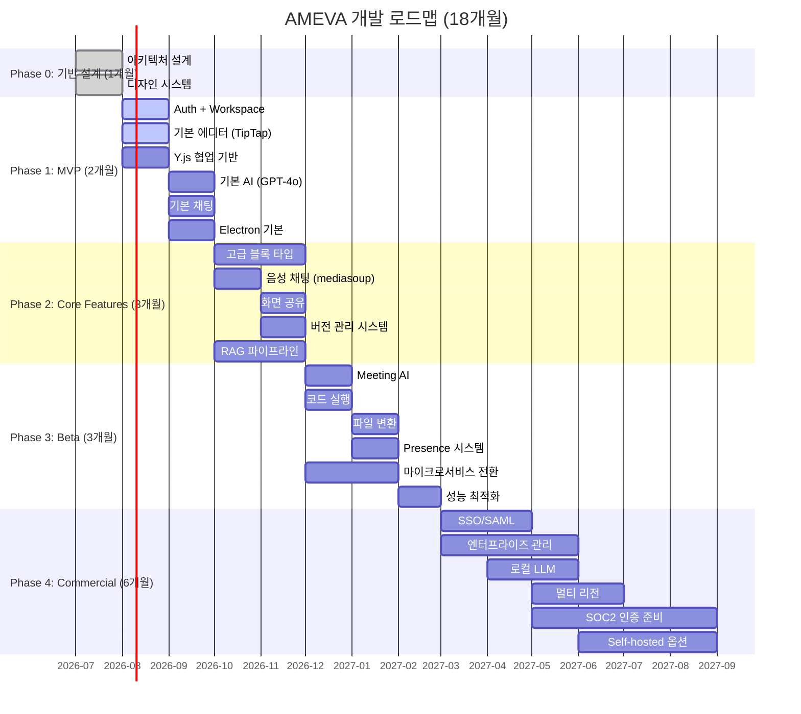

## 30.2 팀 구성 추천

| 역할 | Phase 1 | Phase 2 | Phase 3+ |
|------|---------|---------|---------|
| Frontend (React) | 2명 | 3명 | 5명 |
| Backend (Node.js) | 2명 | 3명 | 5명 |
| AI/ML (Python) | 1명 | 2명 | 3명 |
| DevOps | 1명 | 2명 | 3명 |
| Designer | 1명 | 2명 | 2명 |
| QA | 1명 | 2명 | 3명 |
| PM | 1명 | 1명 | 2명 |
| **합계** | **9명** | **15명** | **23명** |

## 30.3 기술 부채 방지 전략

```
1. TypeScript Strict Mode 필수
2. 테스트 커버리지 80% 이상 (핵심 서비스 95%)
3. API 문서 자동 생성 (FastAPI, Fastify Plugin)
4. 매 스프린트 10% 리팩토링 시간 확보
5. ADR (Architecture Decision Records) 문서화
6. 주간 아키텍처 리뷰 세션
7. 프로덕션 배포 전 보안 리뷰 필수
```

---

# 부록: 기술 스택 최종 요약

| 카테고리 | 기술 | 선정 이유 |
|----------|------|-----------|
| **Frontend** | React 19 + TypeScript 5.5 | Concurrent Mode, 생태계 |
| **Editor** | TipTap + ProseMirror | 최강 블록에디터 기반, Notion 동급 |
| **State** | Zustand + TanStack Query | 단순, 강력, CRDT 친화적 |
| **Animation** | Framer Motion | 선언적, Layout Animation |
| **CRDT** | Y.js | 업계 표준, 오프라인 우선 |
| **Collab Server** | Hocuspocus | Y.js 공식 서버, Redis 확장 |
| **Desktop** | Electron 32 | 가장 성숙한 Node.js 데스크톱 |
| **Build** | Vite 6 + pnpm + Turborepo | 초고속 빌드, 모노레포 |
| **Backend** | Node.js + Fastify | 고처리량, TypeScript 네이티브 |
| **AI Backend** | Python + FastAPI | ML 생태계, async |
| **LLM** | OpenAI + Anthropic + Ollama | 다중 폴백, 프라이버시 옵션 |
| **Vector DB** | Qdrant | 오픈소스, 고성능, Rust 기반 |
| **RAG** | LlamaIndex | 파이썬 RAG 생태계 최고 |
| **STT** | Whisper Large V3 | 한국어 정확도 최고 |
| **Voice** | mediasoup | WebRTC SFU 최고 성능 |
| **Primary DB** | PostgreSQL 16 | JSONB, 논리 복제, 안정성 |
| **Document DB** | MongoDB | 유연한 블록 스키마 |
| **Cache** | Redis 7 Cluster | Pub/Sub, Presence, 세션 |
| **Search** | Elasticsearch 8 | 한국어 형태소, 벡터 하이브리드 |
| **Queue** | Apache Kafka | 대규모 이벤트 스트리밍 |
| **Storage** | AWS S3 | 무제한, CDN, 99.999% 내구성 |
| **Infra** | Kubernetes + Helm | 오케스트레이션 표준 |
| **CI/CD** | GitHub Actions + ArgoCD | GitOps, 카나리 배포 |
| **Monitoring** | Prometheus + Grafana + Jaeger | 완전한 관측성 |
| **CDN** | Cloudflare | DDoS, 글로벌 엣지 |
| **Auth** | Keycloak + JWT | 엔터프라이즈 SSO, SAML |

---

*이 문서는 AMEVA 플랫폼 v1.0 아키텍처 설계서입니다.*  
*작성일: 2026-07-02 | 분류: 기밀 | 버전: 1.0.0*
