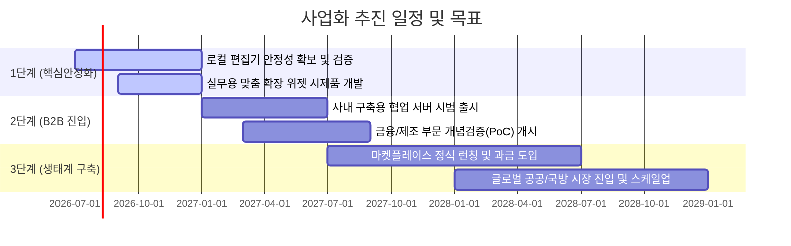

# AMEVA Workstation & Market Place 사업계획서

## 1. 사업 목적 및 배경

### 1.1. 사업의 지향점
본 사업은 보안 규제가 엄격하거나 사내 지적 자산 보호를 최우선으로 하는 기업 및 기관을 대상으로 합니다. 외부 서버나 클라우드로의 데이터 전송을 지양하면서도, 사내 내부 네트워크 환경 내에서 실시간으로 문서 협업을 수행하고 문서 본문 안에서 필요한 간단한 업무 코드 실행과 미디어 관리를 일체화할 수 있는 '오프라인 지향 데스크톱 업무 협업 솔루션(AMEVA Workstation)' 및 '업무 도구 확장 유통 마켓(Market Place)'을 개발·보급하는 것을 목적으로 합니다.

### 1.2. 배경 및 시장 기회
* 망분리 및 데이터 주권 이슈: 금융권, 공공기관, 국가 연구소, 제조업 대기업 연구 부서 등은 법적 규제나 사내 보안 지침에 따라 외부 클라우드 서비스(예: SaaS 기반 문서 도구) 도입에 많은 제약을 받습니다. 또한 외부 퍼블릭 인공지능(AI)을 활용하는 과정에서 사내 중요 소스코드나 특허 관련 기밀 정보가 유출될 가능성이 존재하여 대안이 시급한 상황입니다.
* 통합 생산성 도구 수요의 증가: 텍스트 작성, 데이터 계산 및 통계 그래프 확인, 다이어그램 작성 등 각기 다른 독립 소프트웨어를 오가며 일하는 방식은 업무 전환 비용을 발생시킵니다. 이를 단일 문서 도구 내부에서 안전하게 실행 및 확인하고자 하는 실무 현장의 잠재적 수요가 큽니다.

---

## 2. 해결하고자 하는 문제 (시장 페인 포인트)

### 2.1. 외부 인터넷 단절 환경에서의 협업 부재
보안을 위해 외부망과 내부망을 논리적·물리적으로 분리한 조직에서는 대부분의 현대적인 웹 기반 실시간 협업 문서 도구를 사용할 수 없습니다. 이로 인해 문서 파일을 이메일이나 사내 메신저로 주고받으며 버전을 수동으로 맞추는 고전적인 비효율이 반복되고 있습니다.

### 2.2. 데이터 보안 및 클라우드 이전 한계
많은 기업들이 AI 어시스턴트 도입을 원하지만, 서비스 제공 업체의 클라우드로 사내 핵심 자산이 전송되는 구조는 컴플라이언스(보안 및 법규 준수)를 통과하기 어렵습니다. 보안이 철저히 격리된 환경 내에서 AI 기술을 탑재할 수 있는 로컬 중심 인프라가 요구됩니다.

### 2.3. 연계 업무의 불일치로 인한 작업 단절
데이터 수집, 비즈니스 로직 연산, 다이어그램 설계, 미디어 검토 작업이 각기 다른 외부 전용 툴로 쪼개져 작동함에 따라, 이들의 결과물을 마크다운 등 표준 문서 형식으로 취합하고 가독성 있게 표현하기 위한 사내 표준 도구가 필요한 실정입니다.

---

## 3. 솔루션 구성 및 핵심 가치

### 3.1. 로컬 우선(Local-First) 오프라인 가동 설계
인터넷이 연결되지 않은 단독 환경에서도 모든 데이터 저장과 주요 연산이 사용자 PC 내부에서만 완수되는 구조를 취합니다. 외부와 연결되지 않으므로, 데이터가 타사 인프라에 누적되거나 외부 서버 마비로 인해 전사 업무가 중단되는 현상을 최소화합니다.

### 3.2. 사내 내부망 기반의 동시 협업 기술
중앙에 외부 클라우드 중계 서버를 둘 필요 없이, 사내 내부 로컬 네트워크망에 위치한 전용 중계 노드를 통하여 동료 직원 간 문서를 동시에 열고 편집할 수 있는 실시간 편집 병합 기술을 제공합니다. 이는 물리적으로 완전히 격리된 정부나 대기업 사내망 내에서도 실시간 공동 작업을 가능하게 합니다.

### 3.3. 문서 내 안전한 다국어 업무 코드 실행기
별도의 개발 환경이나 외부 소프트웨어를 실행하지 않고도, 문서 내에 작성된 업무용 자바스크립트(JS), 파이썬(Python), 데이터베이스 쿼리(SQL) 등의 연산 코드를 격리된 가상 환경 내에서 즉석 실행하여 표나 시각 그래프로 자동 렌더링해 줍니다. 데이터의 분석과 문서 기록이 한곳에서 이루어집니다.

### 3.4. 비즈니스 마켓플레이스 확장 생태계
스마트폰의 앱스토어와 유사한 개방형 확장 모델을 제공합니다. 사용자는 자사의 업무 성격에 맞추어 실시간 금융 지표 연동 위젯, 문서 구조 미니맵, 다이어그램 드로잉 판 등 필요한 부가 기능(플러그인)을 선별적으로 워크스테이션에 간편하게 탑재하고, 필요에 따라 이를 외부 상용 개발사들과 거래할 수 있습니다.

---

## 4. 수익 모델 (Revenue Model)

### 4.1. B2B 소프트웨어 라이선스 모델
* 구독형 라이선스: 도입 기업의 활성 직원(User Seat) 수에 비례하여 연간 또는 월간 단위로 사용권을 부여하는 소프트웨어 구독 방식입니다.
* 영구 라이선스 & 온프레미스 패키지: 인터넷 차단 수준이 높은 공공·국방 부문을 위해 일시불 형태의 영구 라이선스를 제공하고, 사내 서버에 직접 설치·운영할 수 있는 온프레미스용 서버 패키지 구축 비용을 일시불로 청구합니다.

### 4.2. 비즈니스 마켓플레이스 중개 플랫폼 수수료
* 플랫폼 생태계가 안착된 이후, 서드파티 개발사들이 AMEVA 마켓플레이스에 등록한 유료 비즈니스 위젯 및 특수 플러그인이 거래될 때 발생하는 결제 대금의 일정 비율(예: 15%~25%)을 플랫폼 중개 수수료로 취득합니다.

### 4.3. 커스텀 플러그인 연동 및 개발 대행 용역
* 대형 기업 고객이 사내 데이터베이스나 ERP(전사적 자원 관리), 그룹웨어 등 기존 내부 레거시 시스템과 워크스테이션을 연동하고자 할 때, 해당 기업에 맞춤화된 특수 전용 플러그인을 개발하여 제공하고 이에 대한 기술 용역비와 유지보수 비용을 청구합니다.

---

## 5. 시장 진입 및 영업 전략

### 5.1. 실무자 중심의 무료 공급 및 자연스러운 확산 (Bottom-Up)
개인 개발자, 연구원, 프리랜서들이 자유롭게 오프라인 저작 도구로 활용할 수 있도록 데스크톱 클라이언트의 기본 버전을 무료(Free)로 제공합니다. 실무 부서원들의 실제 사용 및 긍정적인 내부 피드백을 축적하여, 기업 차원의 대규모 유료 공동 협업 라이선스 도입(전사 계약)을 이끌어내는 상향식 영업 방식을 취합니다.

### 5.2. 규제 준수 및 필수 보안 인증 조기 획득
공공기관 및 금융 분야의 진입 장벽을 넘기 위해 국가 정보보안 관련 심사(예: CC인증, GS인증 등) 가이드라인을 분석하고, 요구되는 보안 스펙을 제품 초기 단계부터 만족시끔으로써 조속한 조달 시장 등록 및 B2G 매출 활로를 확보합니다.

### 5.3. 전문 시스템 통합(SI) 및 대형 총판과의 파트너십 구축
다양한 기업 인프라를 전담 구축하는 주요 대형 SI 파트너사들과 영업 파트너십을 체결합니다. 기존 대기업 그룹웨어 리뉴얼 또는 신규 인프라 도입 사업 발주 시 AMEVA 워크스테이션을 결합 패키지로 함께 제안하여 신속하게 초기 B2B 시장 고객을 확보합니다.

---

## 6. 중장기 성장 로드맵

* 1단계 (Phase 1) - 제품 신뢰성 및 실무 사용성 검증:
  개인 실무자들을 위한 기본 에디터 기능과 로컬 샌드박스의 버그를 완전히 차단하고 안정성을 높입니다. 시장 검증을 위한 업무 편의 위젯(주식, 환율 프록시 연동 및 간단한 비즈니스 템플릿 등)을 패키징하여 배포합니다.
* 2단계 (Phase 2) - B2B 전사 협업 시장 연동 및 판로 개척:
  인터넷이 분리된 환경을 위한 사내 협업 서버 솔루션을 런칭하고, 초기 대기업 연구 조직이나 금융사 특정 부서와의 PoC(개념검증)를 추진하여 실제 상용 계약 레퍼런스를 확보합니다.
* 3단계 (Phase 3) - 마켓플레이스 플랫폼 고도화 및 글로벌 확장:
  외부 개발사들이 플러그인을 업로드하고 수익화할 수 있는 마켓플레이스를 정식 가동하여 기능 확장의 주도권을 외부 시장에 넘기고 생태계 모델로의 안착을 도모합니다. 이를 기반으로 해외 공공·보안 협업 툴 시장에 도전합니다.

---

## 7. 주요 사업 리스크 및 관리 방안

### 7.1. 대형 생산성 클라우드 벤더들의 유사 로컬 기능 제공 리스크
* 리스크 요인: 노션, 마이크로소프트 등 자본력과 기존 점유율이 압도적인 글로벌 빅테크 벤더들이 오프라인 로컬 구동 기능을 고도화하여 보안 시장을 침투할 우려가 있습니다.
* 대응 방안: 단순 오프라인 문서 저장에 그치는 기성 툴과 달리, 아메바는 문서 내부에서 격리된 데이터 집계 코드를 다이렉트로 돌리는 WASM 가상 환경과 유기적인 모듈식 마켓플레이스를 지향합니다. 망분리가 의무화된 국내법 및 규제를 타깃으로 한 로컬 밀착형 맞춤 지원 서비스로 초기 핵심 방어선을 구축합니다.

### 7.2. 서드파티 플러그인 유입 시의 잠재적 보안 위협
* 리스크 요인: 마켓플레이스에 등록된 외부 개발사들의 위젯이나 플러그인 내부 코드가 해킹되어, 역으로 사내 기밀 정보가 몰래 유출되는 보안 백도어로 변질될 가능성이 있습니다.
* 대응 방안: 마켓플레이스에 업로드되는 모든 확장 패키지 파일은 당사의 자동 정적 분석 및 보안 인력의 수동 소스코드 전수 검수를 거쳐 무결성이 검증된 것만 승인(Signing)합니다. 또한, 워크스테이션 내에서 플러그인이 실행될 때도 개인 정보나 특정 디렉토리에 함부로 접근하지 못하도록 샌드박스 보안 격리 메커니즘을 이중화하여 적용합니다.
